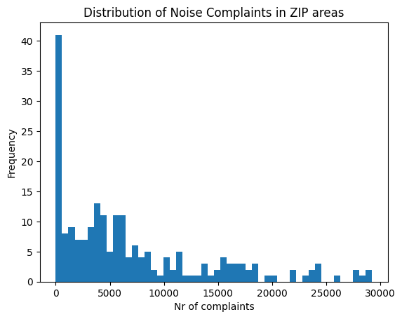
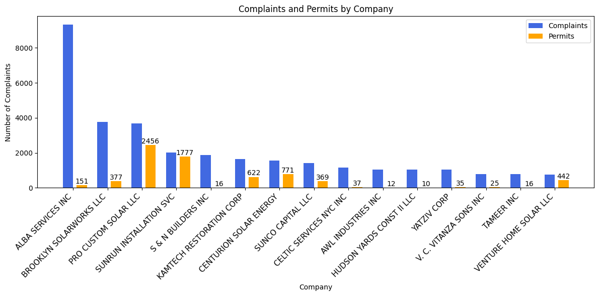

```python
import pandas as pd
import geopandas as gpd
import matplotlib.pyplot as plt
import plotly.express as px
import numpy as np
import json
import folium
import folium.plugins as plugins
from bokeh.plotting import figure, output_file, save
from bokeh.io import output_notebook, show
from bokeh.models import Div, HoverTool, Select, CustomJS, GeoJSONDataSource, AutocompleteInput, Label
from bokeh.models.widgets import CheckboxGroup
from datetime import datetime, timedelta, time
from sklearn.ensemble import RandomForestRegressor
from sklearn.model_selection import train_test_split
from sklearn import metrics
from matplotlib import cm
import matplotlib.colors as mcolors
```


```python
output_notebook()
```


<div class="bk-root">
        <a href="https://bokeh.org" target="_blank" class="bk-logo bk-logo-small bk-logo-notebook"></a>
        <span id="1002">Loading BokehJS ...</span>
    </div>


# 1. Motivation

### 1.1. About dataset

For the data analysis we used two subsets of the dataset NYC 311 Service Requests supported with The Department of Buildings (DOB) issues permits for construction and demolition activities in the City of New York. 

> The main dataset, the **NYC 311 Service Requests** dataset, contains information about service requests made by residents to the New York City government for various non-emergency services. This dataset covers a wide range of issues such as noise complaints, street light outages, potholes, graffiti removal, and many others. The dataset was aquired from NYC Open Data [1].


```python
# Reading in NYC 311 Service Requests dataset, from the year 2023
data = pd.read_csv('311_Noise_Complaints_2023.csv')
data.head()
```

    C:\Users\poczt\AppData\Local\Temp\ipykernel_20388\4118985633.py:2: DtypeWarning: Columns (31) have mixed types. Specify dtype option on import or set low_memory=False.
      data = pd.read_csv('311_Noise_Complaints_2023.csv')
    


<div>
<style scoped>
    .dataframe tbody tr th:only-of-type {
        vertical-align: middle;
    }

    .dataframe tbody tr th {
        vertical-align: top;
    }

    .dataframe thead th {
        text-align: right;
    }
</style>
<table border="1" class="dataframe">
  <thead>
    <tr style="text-align: right;">
      <th></th>
      <th>Unique Key</th>
      <th>Created Date</th>
      <th>Closed Date</th>
      <th>Agency</th>
      <th>Agency Name</th>
      <th>Complaint Type</th>
      <th>Descriptor</th>
      <th>Location Type</th>
      <th>Incident Zip</th>
      <th>Incident Address</th>
      <th>...</th>
      <th>Vehicle Type</th>
      <th>Taxi Company Borough</th>
      <th>Taxi Pick Up Location</th>
      <th>Bridge Highway Name</th>
      <th>Bridge Highway Direction</th>
      <th>Road Ramp</th>
      <th>Bridge Highway Segment</th>
      <th>Latitude</th>
      <th>Longitude</th>
      <th>Location</th>
    </tr>
  </thead>
  <tbody>
    <tr>
      <th>0</th>
      <td>59889383</td>
      <td>12/31/2023 11:59:42 PM</td>
      <td>01/01/2024 01:51:01 AM</td>
      <td>NYPD</td>
      <td>New York City Police Department</td>
      <td>Noise - Street/Sidewalk</td>
      <td>Loud Music/Party</td>
      <td>Street/Sidewalk</td>
      <td>11375.0</td>
      <td>63-10 108 STREET</td>
      <td>...</td>
      <td>NaN</td>
      <td>NaN</td>
      <td>NaN</td>
      <td>NaN</td>
      <td>NaN</td>
      <td>NaN</td>
      <td>NaN</td>
      <td>40.734695</td>
      <td>-73.850521</td>
      <td>(40.734694673156454, -73.85052125577377)</td>
    </tr>
    <tr>
      <th>1</th>
      <td>59887573</td>
      <td>12/31/2023 11:59:39 PM</td>
      <td>01/19/2024 02:37:37 PM</td>
      <td>EDC</td>
      <td>Economic Development Corporation</td>
      <td>Noise - Helicopter</td>
      <td>Other</td>
      <td>Above Address</td>
      <td>10023.0</td>
      <td>25 WEST   73 STREET</td>
      <td>...</td>
      <td>NaN</td>
      <td>NaN</td>
      <td>NaN</td>
      <td>NaN</td>
      <td>NaN</td>
      <td>NaN</td>
      <td>NaN</td>
      <td>40.777201</td>
      <td>-73.976159</td>
      <td>(40.77720102455921, -73.976158989108)</td>
    </tr>
    <tr>
      <th>2</th>
      <td>59893860</td>
      <td>12/31/2023 11:59:29 PM</td>
      <td>01/01/2024 01:51:32 AM</td>
      <td>NYPD</td>
      <td>New York City Police Department</td>
      <td>Noise - Street/Sidewalk</td>
      <td>Loud Music/Party</td>
      <td>Street/Sidewalk</td>
      <td>11374.0</td>
      <td>65-09 99 STREET</td>
      <td>...</td>
      <td>NaN</td>
      <td>NaN</td>
      <td>NaN</td>
      <td>NaN</td>
      <td>NaN</td>
      <td>NaN</td>
      <td>NaN</td>
      <td>40.729379</td>
      <td>-73.855433</td>
      <td>(40.72937885745978, -73.85543290785074)</td>
    </tr>
    <tr>
      <th>3</th>
      <td>59887231</td>
      <td>12/31/2023 11:59:23 PM</td>
      <td>01/01/2024 12:13:30 AM</td>
      <td>NYPD</td>
      <td>New York City Police Department</td>
      <td>Noise - Street/Sidewalk</td>
      <td>Loud Music/Party</td>
      <td>Street/Sidewalk</td>
      <td>11232.0</td>
      <td>870 42 STREET</td>
      <td>...</td>
      <td>NaN</td>
      <td>NaN</td>
      <td>NaN</td>
      <td>NaN</td>
      <td>NaN</td>
      <td>NaN</td>
      <td>NaN</td>
      <td>40.644725</td>
      <td>-73.997622</td>
      <td>(40.64472479285036, -73.9976217135385)</td>
    </tr>
    <tr>
      <th>4</th>
      <td>59889382</td>
      <td>12/31/2023 11:59:13 PM</td>
      <td>01/01/2024 01:50:57 AM</td>
      <td>NYPD</td>
      <td>New York City Police Department</td>
      <td>Noise - Street/Sidewalk</td>
      <td>Loud Music/Party</td>
      <td>Street/Sidewalk</td>
      <td>11375.0</td>
      <td>63-10 108 STREET</td>
      <td>...</td>
      <td>NaN</td>
      <td>NaN</td>
      <td>NaN</td>
      <td>NaN</td>
      <td>NaN</td>
      <td>NaN</td>
      <td>NaN</td>
      <td>40.734695</td>
      <td>-73.850521</td>
      <td>(40.734694673156454, -73.85052125577377)</td>
    </tr>
  </tbody>
</table>
<p>5 rows × 41 columns</p>
</div>


311 Service Requests from 2010 to Present is updated daily and contains around 36.2 million rows and 41 columns. 311 is a phone number used in the U.S. that allows callers to access non-emergency municipal services, report problems to government agencies, and request information.

The data typically includes details such as the type of request, the location of the issue, the date and time the request was made and closed, and the agency responsible for addressing the problem. It's a valuable resource for analyzing patterns of public service needs across different neighborhoods in New York City, identifying areas that require attention or improvement, and assessing the responsiveness of city agencies to citizen complaints. 

Researchers, analysts, and policymakers often use this dataset to gain insights into urban issues, improve service delivery, and inform decision-making processes aimed at enhancing the quality of life for residents. 

**This analysis will mainly discuss two NYC 311 Service Requests data subsets - the data gathered from 2023, specifically focused on the noise complaints across the city, which will be used together with previously mentioned building permits dataset, as well as a data gathered from 2010 to 2023, with 'Location Type' set to 'Residential Building/House', 'Descriptor' set to 'Loud Music/Party' and 'Complaint Type' set to 'Noise - Residential'. This initial filtering of data was done with intetion of using the subset to analyze noise complaints strictly from house parties, throughout the years.**

> **Department of Buildings (DOB) Permits** can offer insights into construction and demolition activities happening across the city. By examining permit data in conjunction with noise complaints, you can explore correlations between construction work and noise disturbances, as well as assess compliance with noise regulations [2].


```python
# Reading in Department of Buildings (DOB) Permits dataset
path= r"DOB_Permit_Issuance_20240421.csv"
permit_data = pd.read_csv(path)
permit_data.head()
```


<div>
<style scoped>
    .dataframe tbody tr th:only-of-type {
        vertical-align: middle;
    }

    .dataframe tbody tr th {
        vertical-align: top;
    }

    .dataframe thead th {
        text-align: right;
    }
</style>
<table border="1" class="dataframe">
  <thead>
    <tr style="text-align: right;">
      <th></th>
      <th>BOROUGH</th>
      <th>Bin #</th>
      <th>House #</th>
      <th>Street Name</th>
      <th>Job #</th>
      <th>Job doc. #</th>
      <th>Job Type</th>
      <th>Self_Cert</th>
      <th>Block</th>
      <th>Lot</th>
      <th>...</th>
      <th>Owner’s House State</th>
      <th>Owner’s House Zip Code</th>
      <th>Owner's Phone #</th>
      <th>DOBRunDate</th>
      <th>PERMIT_SI_NO</th>
      <th>LATITUDE</th>
      <th>LONGITUDE</th>
      <th>COUNCIL_DISTRICT</th>
      <th>CENSUS_TRACT</th>
      <th>NTA_NAME</th>
    </tr>
  </thead>
  <tbody>
    <tr>
      <th>0</th>
      <td>BROOKLYN</td>
      <td>3057705</td>
      <td>1084</td>
      <td>FULTON STREET</td>
      <td>321953891</td>
      <td>2</td>
      <td>A2</td>
      <td>N</td>
      <td>2016</td>
      <td>20</td>
      <td>...</td>
      <td>NaN</td>
      <td>NaN</td>
      <td>7.183871e+09</td>
      <td>11/22/2023 00:00:00</td>
      <td>3967198</td>
      <td>40.681528</td>
      <td>-73.957603</td>
      <td>36.0</td>
      <td>227.0</td>
      <td>Clinton Hill</td>
    </tr>
    <tr>
      <th>1</th>
      <td>BROOKLYN</td>
      <td>3166244</td>
      <td>24</td>
      <td>BAY 11TH STREET</td>
      <td>340905275</td>
      <td>1</td>
      <td>A2</td>
      <td>N</td>
      <td>6361</td>
      <td>51</td>
      <td>...</td>
      <td>NaN</td>
      <td>NaN</td>
      <td>3.474747e+09</td>
      <td>11/22/2023 00:00:00</td>
      <td>3967199</td>
      <td>40.609957</td>
      <td>-74.008655</td>
      <td>43.0</td>
      <td>172.0</td>
      <td>Bath Beach</td>
    </tr>
    <tr>
      <th>2</th>
      <td>STATEN ISLAND</td>
      <td>5052978</td>
      <td>307</td>
      <td>NAUGHTON AVE</td>
      <td>540246134</td>
      <td>1</td>
      <td>A2</td>
      <td>N</td>
      <td>3652</td>
      <td>60</td>
      <td>...</td>
      <td>NaN</td>
      <td>NaN</td>
      <td>9.178367e+09</td>
      <td>05/02/2023 00:00</td>
      <td>3948737</td>
      <td>40.583785</td>
      <td>-74.093882</td>
      <td>50.0</td>
      <td>11201.0</td>
      <td>Old Town-Dongan Hills-South Beach</td>
    </tr>
    <tr>
      <th>3</th>
      <td>STATEN ISLAND</td>
      <td>5172013</td>
      <td>48</td>
      <td>HENDRICKS AVENUE</td>
      <td>540249337</td>
      <td>1</td>
      <td>A2</td>
      <td>N</td>
      <td>39</td>
      <td>29</td>
      <td>...</td>
      <td>NaN</td>
      <td>NaN</td>
      <td>9.172578e+09</td>
      <td>05/02/2023 00:00</td>
      <td>3948738</td>
      <td>40.640468</td>
      <td>-74.083137</td>
      <td>49.0</td>
      <td>11.0</td>
      <td>West New Brighton-New Brighton-St. George</td>
    </tr>
    <tr>
      <th>4</th>
      <td>BROOKLYN</td>
      <td>3108295</td>
      <td>59</td>
      <td>EAST 40 STREET</td>
      <td>340906087</td>
      <td>1</td>
      <td>A2</td>
      <td>N</td>
      <td>4861</td>
      <td>51</td>
      <td>...</td>
      <td>NaN</td>
      <td>NaN</td>
      <td>3.472285e+09</td>
      <td>11/22/2023 00:00:00</td>
      <td>3967200</td>
      <td>40.654432</td>
      <td>-73.940354</td>
      <td>41.0</td>
      <td>814.0</td>
      <td>East Flatbush-Farragut</td>
    </tr>
  </tbody>
</table>
<p>5 rows × 60 columns</p>
</div>


> We also used a NYC ZIP codes geojson for map visualization purposes, taken from [4]

### 1.2. Why we chose those datasets

Those datasets are a rich source of information for understanding various aspects of city life and infrastructure. 311 Service Requests data contains a vast array of service requests made to the New York City government since 2010, providing a comprehensive view of the types of issues residents face and the responses from municipal agencies. Analyzing this data can provide insights into urban living conditions, community needs and government responsiveness. 

Combining the NYC 311 Service Requests dataset with the Department of Buildings (DOB) Permits data can enhance the depth and breadth of analysis of service disparities across different demographic groups and neighborhoods as well as assess how changes in permit regulations impact service requests related to construction or building code violations can inform policy adjustments. Understanding how factors such as income, race, and population density correlate with service requests can help identify areas in need of targeted interventions.

We focused specifically on examining noise complaints around the city, since this is the group that accounts for the biggest number of reported complaints. Additionally we think that noise pollution is one of the most important and prevalent issues when it comes to city life. Due to the size of the dataset the analysis will be conducted already on the filtered data subset, as mentioned before.

Understanding noise complaints can provide valuable insights into the quality of life and urban environment in New York City. Noise pollution is a common concern in densely populated urban areas and can have significant impacts on residents' well-being and health. We aim to understand the noise pollution in NYC from two angles: analysing the noise coming from construction sites and well as house parties in NYC.

### 1.3. Goal for the end user's experience

The goal for the end user's experience when interacting with the integrated dataset comprising NYC 311 Noise Complaints and DOB Permits data is focus on several key objectives:

<ul>
 <li>Understand which NYC areas are most notorious for loud house parties. On the other hand, to find out which areas are "safer" for residents to throw parties without disturbing their neighbours as much.</li><br>
    
 <li>Predict at which time a noise complaint for a house party will most likely be filled, depending on the NYC area as well as time of the year and time of the week.</li><br>
    
 <li>Provide users with a better understanding of the extent of construction-related noise issues in different neighborhoods of New York City.</li><br>
<li>Enable users to identify specific areas or companies associated with the highest number of complaints</li><br>    
 </ul>

# 2. Basic stats

As explained in the first section this project utilizes 3 different datasets. The following section provides insights into preliminary data analysis for each of the chosen sets. 
### 2.1. Data cleaning and preprocessing 

#### NYC 311 House Party Noise Complaints from 2010 to 2023


```python
# Read in data
data_party = pd.read_csv('house_party_complaints_2010_2023.csv')
```

    C:\Users\poczt\AppData\Local\Temp\ipykernel_20388\3451936411.py:2: DtypeWarning: Columns (15,17,18,20) have mixed types. Specify dtype option on import or set low_memory=False.
      data_party = pd.read_csv('house_party_complaints_2010_2023.csv')
    

**Key points from NYC 311 House Party Noise Complaints dataset cleaning and preprocessing.**
* The format of date and time fields was standardized to ensure consistency across the dataset. "Created Date" and "Closed Date" were converted from string format to a standardized datetime format, which will allow for easier manipulation and analysis of date and time data.
* Unnecessary columns were removed from the dataset. Some were redundant because of their singular value throughout the whole dataset (like 'Complaint Type' or 'Location Type'), while some were just not usefult for the chosen analysis topic.
* Borough names were uncapitalized (e.g. from BRONX to Bronx) to improve readability
* Rows with empty 'Incident Zip' cells were removed, as ZIP code areas will be the basis for our analysis.
* Time fields like 'Month', 'Weekday' or 'Time' were extracted from the created date. Time is represented as amount of minutes that passed since previous noon (12PM). We chose this representation to make predicting models life easier later, as house parties usually last throughout the night, and values such as 23:56 and 00:11 shouldn't be far apart.
* Duplicate noise complaints for the same night in the same location were removed, keeping only the first instance. Instead, an additional column called 'Complaints Count' was added, indicating if multiple complaints were filed for that location that night. We decided to treat all complaints until 7AM as part of the previous night's party, which is where the 'Adjusted Date' column came in handy.
* We also made sure at a later point that no Borough had value "Unspecified". We mapped the 'Incident Zip' in those rows to a proper Borough name.


```python
# Function to turn a datetime object to integer represantion of time, in form of minutes that passed until last noon (12 p.m.)
def minutes_since_noon(dt):
    if dt.time() < time(12, 0):
        delta = dt - datetime.combine(dt.date() - timedelta(days=1), time(12, 0))
    else:
        delta = dt - datetime.combine(dt.date(), time(12, 0))
    return delta.seconds // 60

# Convert to datetime
data_party['Created Date'] = pd.to_datetime(data_party['Created Date'], format="%m/%d/%Y %I:%M:%S %p")
data_party['Closed Date'] = pd.to_datetime(data_party['Closed Date'], format="%m/%d/%Y %I:%M:%S %p")

# Remove unnecessary columns
data_party = data_party.drop(columns=['Vehicle Type', 'Taxi Company Borough', 'Taxi Pick Up Location', 'Bridge Highway Name', 'Bridge Highway Direction',
                            'Road Ramp', 'Bridge Highway Segment', 'Park Borough', 'Park Facility Name', 'BBL', 'Community Board', 'Descriptor',
                            'Location Type', 'Complaint Type', 'Landmark','Facility Type','Due Date'],
                            errors='ignore')

# Uncapitalize borough names (e.g. from BRONX to Bronx)
data_party.Borough = data_party.Borough.str.title()

# Remove empty zip codes
data_party = data_party[~data_party['Incident Zip'].isnull()]

# Add date columns
data_party['Month'] = data_party['Created Date'].dt.month
data_party['Weekday'] = data_party['Created Date'].dt.weekday
data_party['Time'] = data_party['Created Date'].apply(minutes_since_noon)

# Remove duplicate complaints for the same location the same night, but keep the count
data_party['Adjusted Date'] = data_party['Created Date'].apply(lambda dt: dt.date() if dt.time() > pd.Timestamp('07:00:00').time() else (dt - pd.Timedelta(days=1)).date())
data_party = data_party.sort_values('Created Date')
grouped = data_party.groupby(['Adjusted Date', 'Incident Address']).size().reset_index(name='Complaints Count')
data_party = pd.merge(left=data_party, right=grouped)
data_party = data_party.drop_duplicates(subset=['Adjusted Date', 'Incident Address'])

# Print out head
data_party.head()
```


<div>
<style scoped>
    .dataframe tbody tr th:only-of-type {
        vertical-align: middle;
    }

    .dataframe tbody tr th {
        vertical-align: top;
    }

    .dataframe thead th {
        text-align: right;
    }
</style>
<table border="1" class="dataframe">
  <thead>
    <tr style="text-align: right;">
      <th></th>
      <th>Unique Key</th>
      <th>Created Date</th>
      <th>Closed Date</th>
      <th>Agency</th>
      <th>Agency Name</th>
      <th>Incident Zip</th>
      <th>Incident Address</th>
      <th>Street Name</th>
      <th>Cross Street 1</th>
      <th>Cross Street 2</th>
      <th>...</th>
      <th>Y Coordinate (State Plane)</th>
      <th>Open Data Channel Type</th>
      <th>Latitude</th>
      <th>Longitude</th>
      <th>Location</th>
      <th>Month</th>
      <th>Weekday</th>
      <th>Time</th>
      <th>Adjusted Date</th>
      <th>Complaints Count</th>
    </tr>
  </thead>
  <tbody>
    <tr>
      <th>0</th>
      <td>15628757</td>
      <td>2010-01-01 00:08:02</td>
      <td>2010-01-01 03:53:37</td>
      <td>NYPD</td>
      <td>New York City Police Department</td>
      <td>11220.0</td>
      <td>876 58 STREET</td>
      <td>58 STREET</td>
      <td>8 AVENUE</td>
      <td>9 AVENUE</td>
      <td>...</td>
      <td>170882.0</td>
      <td>PHONE</td>
      <td>40.635708</td>
      <td>-74.006853</td>
      <td>(40.635707991592696, -74.00685286309795)</td>
      <td>1</td>
      <td>4</td>
      <td>728</td>
      <td>2009-12-31</td>
      <td>1</td>
    </tr>
    <tr>
      <th>1</th>
      <td>15627442</td>
      <td>2010-01-01 00:08:29</td>
      <td>2010-01-01 00:27:41</td>
      <td>NYPD</td>
      <td>New York City Police Department</td>
      <td>10036.0</td>
      <td>317 WEST 45 STREET</td>
      <td>WEST 45 STREET</td>
      <td>8 AVENUE</td>
      <td>9 AVENUE</td>
      <td>...</td>
      <td>215978.0</td>
      <td>PHONE</td>
      <td>40.759486</td>
      <td>-73.989135</td>
      <td>(40.75948567983112, -73.98913488475046)</td>
      <td>1</td>
      <td>4</td>
      <td>728</td>
      <td>2009-12-31</td>
      <td>1</td>
    </tr>
    <tr>
      <th>2</th>
      <td>15628369</td>
      <td>2010-01-01 00:15:12</td>
      <td>2010-01-01 02:35:35</td>
      <td>NYPD</td>
      <td>New York City Police Department</td>
      <td>10014.0</td>
      <td>333 WEST 11 STREET</td>
      <td>WEST 11 STREET</td>
      <td>GREENWICH STREET</td>
      <td>WASHINGTON STREET</td>
      <td>...</td>
      <td>207278.0</td>
      <td>PHONE</td>
      <td>40.735607</td>
      <td>-74.007697</td>
      <td>(40.735606621969815, -74.00769667288294)</td>
      <td>1</td>
      <td>4</td>
      <td>735</td>
      <td>2009-12-31</td>
      <td>1</td>
    </tr>
    <tr>
      <th>3</th>
      <td>15628147</td>
      <td>2010-01-01 00:19:07</td>
      <td>2010-01-01 08:31:26</td>
      <td>NYPD</td>
      <td>New York City Police Department</td>
      <td>10453.0</td>
      <td>1702 GRAND AVENUE</td>
      <td>GRAND AVENUE</td>
      <td>WEST 175 STREET</td>
      <td>WEST 176 STREET</td>
      <td>...</td>
      <td>248407.0</td>
      <td>PHONE</td>
      <td>40.848463</td>
      <td>-73.914058</td>
      <td>(40.84846286296289, -73.91405798979748)</td>
      <td>1</td>
      <td>4</td>
      <td>739</td>
      <td>2009-12-31</td>
      <td>1</td>
    </tr>
    <tr>
      <th>4</th>
      <td>15628798</td>
      <td>2010-01-01 00:27:45</td>
      <td>2010-01-01 01:53:10</td>
      <td>NYPD</td>
      <td>New York City Police Department</td>
      <td>11218.0</td>
      <td>430 OCEAN PARKWAY</td>
      <td>OCEAN PARKWAY</td>
      <td>CORTELYOU ROAD</td>
      <td>DITMAS AVENUE</td>
      <td>...</td>
      <td>171701.0</td>
      <td>PHONE</td>
      <td>40.637953</td>
      <td>-73.973088</td>
      <td>(40.63795302715787, -73.97308845571062)</td>
      <td>1</td>
      <td>4</td>
      <td>747</td>
      <td>2009-12-31</td>
      <td>1</td>
    </tr>
  </tbody>
</table>
<p>5 rows × 29 columns</p>
</div>


```python
# Total size
print(f"Number of rows: {data_party.shape[0]}")
print(f"Number of columns: {data_party.shape[1]}")
```

    Number of rows: 1447394
    Number of columns: 29
    


```python
# Columns that were left
print(data_party.columns.values)
```

    ['Unique Key' 'Created Date' 'Closed Date' 'Agency' 'Agency Name'
     'Incident Zip' 'Incident Address' 'Street Name' 'Cross Street 1'
     'Cross Street 2' 'Intersection Street 1' 'Intersection Street 2'
     'Address Type' 'City' 'Status' 'Resolution Description'
     'Resolution Action Updated Date' 'Borough' 'X Coordinate (State Plane)'
     'Y Coordinate (State Plane)' 'Open Data Channel Type' 'Latitude'
     'Longitude' 'Location' 'Month' 'Weekday' 'Time' 'Adjusted Date'
     'Complaints Count']
    


```python
# Date range
min_date = data_party['Created Date'].min()
max_date = data_party['Created Date'].max()
date_range = max_date - min_date
print(f"Date range: {date_range.days} days, from {min_date} to {max_date}")
```

    Date range: 5112 days, from 2010-01-01 00:08:02 to 2023-12-31 23:58:16
    


```python
# Quick look at the number of complaints
with open('new-york-zip-codes-_1604.geojson') as file:
    nyc_zips = json.load(file)

grouped_zip = data_party.groupby(['Incident Zip']).size().reset_index(name='count')
max_val = max(grouped_zip['count'])
min_val = min(grouped_zip['count'])
lat = data_party.Latitude.mean()
lon = data_party.Longitude.mean()
fig = px.choropleth_mapbox(grouped_zip, 
                           geojson=nyc_zips, 
                           locations='Incident Zip', 
                           featureidkey='properties.ZCTA5CE10',
                           color='count',
                           mapbox_style="carto-positron",
                           zoom=9, 
                           center = {"lat": lat, "lon": lon},
                           range_color=(min_val, max_val),
                           color_continuous_scale="Oranges",
                           opacity=0.5
                          )

fig.update_layout(margin={"r":0,"t":0,"l":0,"b":0})
fig.show()
```


```python
data_grouped = data_party.groupby(['Incident Zip']).size().reset_index(name='NoiseComplaints')
plt.hist(data_grouped['NoiseComplaints'], bins=50)
plt.title('Distribution of Noise Complaints in ZIP areas')
plt.xlabel('Nr of complaints')
plt.ylabel('Frequency')
plt.show()
```


    

    


#### NYC 311 Noise Complaints from 2023


```python
# Total size of the dataset NYC 311 Service Requests
print(f"Number of rows: {data.shape[0]}")
print(f"Number of columns: {data.shape[1]}")
```

    Number of rows: 686231
    Number of columns: 41
    


```python
columns_to_drop = ["Taxi Company Borough", "Taxi Pick Up Location", 
                   "Bridge Highway Name", "Bridge Highway Direction", 
                   "Road Ramp", "Bridge Highway Segment", "Due Date", 
                   "Facility Type", "Vehicle Type"]

data = data.drop(columns=columns_to_drop)
```


```python
# Duplicated rows
duplicate_rows = data[data.duplicated()]
print("Duplicate rows:")
```

    Duplicate rows:
    


```python
unique_types = data['Descriptor'].nunique()
print(f"Number of unique types: {unique_types}")
# print(noise_data['Descriptor'].unique())

descriptor_counts = data.groupby('Descriptor').size()
# Sort the counts in descending order
descriptor_counts_sorted = descriptor_counts.sort_values(ascending=False)
print(descriptor_counts_sorted)
```

    Number of unique types: 24
    Descriptor
    Loud Music/Party                                        353547
    Banging/Pounding                                        103549
    Loud Talking                                             58725
    Other                                                    57312
    Car/Truck Music                                          34239
    Noise: Construction Before/After Hours (NM1)             21752
    Engine Idling                                            10349
    Car/Truck Horn                                            9047
    Noise: Construction Equipment (NC1)                       8056
    Noise, Barking Dog (NR5)                                  7737
    Loud Television                                           5002
    Noise: Alarms (NR3)                                       4360
    Noise: air condition/ventilation equipment (NV1)          4211
    Noise: Jack Hammering (NC2)                               2398
    Noise, Ice Cream Truck (NR4)                              1539
    News Gathering                                            1094
    Noise:  lawn care equipment (NCL)                         1083
    Noise: Private Carting Noise (NQ1)                         841
    NYPD                                                       721
    Noise, Other Animals (NR6)                                 268
    Noise: Boat(Engine,Music,Etc) (NR10)                       248
    Noise: Manufacturing Noise (NK1)                           118
    Noise: Other Noise Sources (Use Comments) (NZZ)             34
    Noise: Loud Music/Daytime (Mark Date And Time) (NN1)         1
    dtype: int64
    


```python
# Define list of construction related descriptors
construction_noise_complains = ['Noise: Construction Before/After Hours (NM1)', 'Noise: Construction Equipment (NC1)', 'Noise: Jack Hammering (NC2)']
data = data[data['Descriptor'].isin(construction_noise_complains)]
# Drop that data that doesn't have Latitude, Longitude fields.
data = data.dropna(subset=['Latitude', 'Longitude'], inplace=False)
print(f"Total number of observations inside construction-noise related data: {len(data)}")
```

    Total number of observations inside construction-noise related data: 31615
    


```python
# Standardizing Data Formats

data['Created Date'] = pd.to_datetime(data['Created Date'], format="%m/%d/%Y %I:%M:%S %p")
data['Closed Date'] = pd.to_datetime(data['Closed Date'], format="%m/%d/%Y %I:%M:%S %p")
```


```python
# Date range

min_date = data['Created Date'].min()
max_date = data['Created Date'].max()
date_range = max_date - min_date
print(f"Date range: {date_range.days} days, from {min_date} to {max_date}")
```

    Date range: 364 days, from 2023-01-01 08:38:00 to 2023-12-31 18:02:00
    

**Key points from NYC 311 Noise Service Requests dataset cleaning and preprocessing.**
* There is a number of missing values in almost every column. The columns "Taxi Company Borough", "Taxi Pick Up Location", "Bridge Highway Name", "Bridge Highway Direction", "Road Ramp", "Bridge Highway Segment" and "Due Date" appear to have only missing values, therefore we decided to drop the columns.
* Based on unique complaint descriptions a construction work-related list has been defined and 311 datasets have been filtered to include only the relevant data.
* The rest of the features we opted to remain, since they seem to be related to the noise complaints.
* The format of date and time fields was standardized to ensure consistency across the dataset. "Created Date" and "Closed Date" were converted from string format to a standardized datetime format, which will allow for easier manipulation and analysis of date and time data.
* There are no duplicated rows in the dataset.

#### Department of Building (DOB) Permit Data.


```python
# Standardizing Data Formats
permit_data['Filing Date'] = pd.to_datetime(permit_data['Filing Date'], format="%m/%d/%Y")
permit_data['Expiration Date'] = pd.to_datetime(permit_data['Expiration Date'], format="%m/%d/%Y")
permit_data['Issuance Date'] = pd.to_datetime(permit_data['Issuance Date'], format="%m/%d/%Y")
permit_data['Job Start Date'] = pd.to_datetime(permit_data['Job Start Date'], format="%m/%d/%Y")
permit_data['Owner\'s Business Name'] = permit_data['Owner\'s Business Name'].replace('NYCSCA', 'NYC SCA')
permit_data = permit_data.dropna(subset=['LATITUDE', 'LONGITUDE'], inplace=False)
```


```python
# Total size of DOB permit data
print(f"Number of rows: {permit_data.shape[0]}")
print(f"Number of columns: {permit_data.shape[1]}")

# Other properties
min_date = permit_data['Job Start Date'].min()
max_date = permit_data['Job Start Date'].max()
date_range = max_date - min_date
print(f"Job permits for date range: {date_range.days} days, from {min_date} to {max_date}")

unique_types = permit_data['Permittee\'s Business Name'].nunique()
print(f"Number of unique companies that received permits: {unique_types}")
```

    Number of rows: 14424
    Number of columns: 60
    Job permits for date range: 361 days, from 2023-01-02 00:00:00 to 2023-12-29 00:00:00
    Number of unique companies that received permits: 1360
    


```python
print(f"Most interesting columns inside the Permit Dataset\n")
print(f"{permit_data[['Job Start Date', 'BOROUGH', 'Job #', 'LATITUDE', 'LONGITUDE']].head()}")
```

    Most interesting columns inside the Permit Dataset
    
      Job Start Date        BOROUGH      Job #   LATITUDE  LONGITUDE
    0     2023-11-21       BROOKLYN  321953891  40.681528 -73.957603
    1     2023-11-21       BROOKLYN  340905275  40.609957 -74.008655
    2     2023-05-01  STATEN ISLAND  540246134  40.583785 -74.093882
    3     2023-05-01  STATEN ISLAND  540249337  40.640468 -74.083137
    4     2023-11-21       BROOKLYN  340906087  40.654432 -73.940354
    

**Key points from Department of Building (DOB) Permit Data cleaning and preprocessing.**
* To ensure that the data can be loaded efficiently it was necessary to specify the data format for the DateTime fields
* Data analysis revealed that the New York City School Construction Authority is present in the dataset under two different names, that is NYCSCA and NYC SCA. To ensure that the homogeneity of data has been unified.
* Less than 1% of the data didn't have a location value or Owner's Business Name value. As this was crucial for further analysis this data has been removed from the dataset.
* Most interesting columns and example values have been printed in the last part of the data analysis.

## 3. Data Analysis
#### House Parties


```python
# First we created some helper dictionary structures

zip_borough_dict = {
    'Queens': [],
    'Bronx': [],
    'Brooklyn': [],
    'Staten Island': [],
    'Manhattan': [],
}

zip_to_borough = {}

def find_borough(zip):
    if zip=='11208' or zip=='11237':
        return 'Brooklyn'
    if zip == '11421':
        return 'Queens'
    if zip=='10463':
        return 'Bronx'
    return 'Unspecified'

# Fill the dictionary and assing correct borough if it's "Unspecified"
for index, row in data_party.iterrows():
    borough = row['Borough']
    zip_code = str(int(row['Incident Zip']))
    if borough=='Unspecified':
        borough = find_borough(zip_code)
        data_party.at[index, 'Borough'] = borough
    if zip_code not in zip_borough_dict[borough]:
        zip_borough_dict[borough].append(zip_code)
    if zip_code not in zip_to_borough:
        zip_to_borough[zip_code] = borough

# Remove not real ZIPs and sort data
zip_borough_dict['Manhattan'].remove('83')
zip_borough_dict['Manhattan'].remove('12345')
for key,zips in zip_borough_dict.items():
    zip_borough_dict[key] = sorted(zips)
```


```python
# Create a machine learning model

X = data_party[['Month', 'Weekday', 'Incident Zip']]
y = data_party['Time']
X_train, X_test, y_train, y_test = train_test_split(X, y, test_size=0.2, random_state=42)

model = RandomForestRegressor(n_estimators=300, random_state=42)
model.fit(X_train, y_train)
y_pred = model.predict(X_test)

print('Mean Absolute Error:', metrics.mean_absolute_error(y_test, y_pred))
print('Mean Squared Error:', metrics.mean_squared_error(y_test, y_pred))
print('Root Mean Squared Error:', np.sqrt(metrics.mean_squared_error(y_test, y_pred)))  

# Function to make a prediction based on a given month, weekday and zipcode
def predict_complaint_time(month, weekday, zipcode):
    X = pd.DataFrame({'Month': month, 'Weekday': weekday, 'Incident Zip': zipcode})
    predicted_time = model.predict(X)
    return predicted_time

# Function to convert minutes after noon to actual time
def minutes_to_time(minutes):
    noon_previous_day = datetime.combine(datetime.now().date() - timedelta(days=1), time(12, 0))
    return str((noon_previous_day + timedelta(minutes=minutes)).time())
```

    Mean Absolute Error: 193.23640472264972
    Mean Squared Error: 70597.39899049004
    Root Mean Squared Error: 265.70171055243515
    

We picked a Random Forest Regressor, as it's a good tool for predicting continouous values and it outperformed other models we tried (e.g. Decision Tree gave a worse result in a bit shorter amount of compute time, while a Neural Network needed much more time to even achieve the same result. Neural Network would probably ultimately be better after sufficient training loops, however the cost vs profit wasn't ideal for us)

The result we got is still not great - we have an absolute mean error of around 193 mins, so over 3 hours, but it is a step in the right direction. We believe that with more data and more computational power the result would be better.


```python
# We needed to create data for all possible month/weekday intersecions to pass to Bokeh 
# interactive plots (browsers cannot calclate live Python code)

gdf = gpd.read_file('new-york-zip-codes-_1604.geojson')

# Prefilter data
filtered_data = {}
for m in range(-1,13):
    if (m != 0):
        filtered_data[str(m)] = {}
        for w in range (-1,7):
            if w==-1 and m==-1:
                temp = data_party
            elif w==-1:
                temp = data_party[data_party.Month==m]
            elif m==-1:
                temp = data_party[data_party.Weekday == w]
            else:
                temp = data_party[(data_party.Weekday == w) & (data_party.Month==m)]
            temp['Incident Zip'] = temp['Incident Zip'].astype(int).astype(str)
            temp = temp.groupby(['Incident Zip']).size().reset_index(name='NoiseComplaints')
            filtered_data[str(m)][str(w)] = temp.set_index('Incident Zip')['NoiseComplaints'].to_dict()
            filtered_data[str(m)][str(w)]['max'] = temp['NoiseComplaints'].max()

# Precalculate all time predictions for all ZIPs and month/weekdays
df = pd.DataFrame(np.array(np.meshgrid(np.arange(1, 13), np.arange(7), gdf['ZCTA5CE10'].astype(str))).T.reshape(-1,3), columns=['month', 'weekday', 'zip'])
df['prediction'] = predict_complaint_time(df['month'], df['weekday'], df['zip'])
df['prediction'] = df['prediction'].apply(minutes_to_time)
nested_dict = df.groupby('month').apply(lambda x: x.groupby('weekday').apply(lambda y: y.set_index('zip')['prediction'].to_dict()).to_dict()).to_dict()
```

    C:\Users\poczt\AppData\Local\Temp\ipykernel_20388\1478489561.py:20: SettingWithCopyWarning:
    
    
    A value is trying to be set on a copy of a slice from a DataFrame.
    Try using .loc[row_indexer,col_indexer] = value instead
    
    See the caveats in the documentation: https://pandas.pydata.org/pandas-docs/stable/user_guide/indexing.html#returning-a-view-versus-a-copy
    
    C:\Users\poczt\AppData\Local\Temp\ipykernel_20388\1478489561.py:20: SettingWithCopyWarning:
    
    
    A value is trying to be set on a copy of a slice from a DataFrame.
    Try using .loc[row_indexer,col_indexer] = value instead
    
    See the caveats in the documentation: https://pandas.pydata.org/pandas-docs/stable/user_guide/indexing.html#returning-a-view-versus-a-copy
    
    C:\Users\poczt\AppData\Local\Temp\ipykernel_20388\1478489561.py:20: SettingWithCopyWarning:
    
    
    A value is trying to be set on a copy of a slice from a DataFrame.
    Try using .loc[row_indexer,col_indexer] = value instead
    
    See the caveats in the documentation: https://pandas.pydata.org/pandas-docs/stable/user_guide/indexing.html#returning-a-view-versus-a-copy
    
    C:\Users\poczt\AppData\Local\Temp\ipykernel_20388\1478489561.py:20: SettingWithCopyWarning:
    
    
    A value is trying to be set on a copy of a slice from a DataFrame.
    Try using .loc[row_indexer,col_indexer] = value instead
    
    See the caveats in the documentation: https://pandas.pydata.org/pandas-docs/stable/user_guide/indexing.html#returning-a-view-versus-a-copy
    
    C:\Users\poczt\AppData\Local\Temp\ipykernel_20388\1478489561.py:20: SettingWithCopyWarning:
    
    
    A value is trying to be set on a copy of a slice from a DataFrame.
    Try using .loc[row_indexer,col_indexer] = value instead
    
    See the caveats in the documentation: https://pandas.pydata.org/pandas-docs/stable/user_guide/indexing.html#returning-a-view-versus-a-copy
    
    C:\Users\poczt\AppData\Local\Temp\ipykernel_20388\1478489561.py:20: SettingWithCopyWarning:
    
    
    A value is trying to be set on a copy of a slice from a DataFrame.
    Try using .loc[row_indexer,col_indexer] = value instead
    
    See the caveats in the documentation: https://pandas.pydata.org/pandas-docs/stable/user_guide/indexing.html#returning-a-view-versus-a-copy
    
    C:\Users\poczt\AppData\Local\Temp\ipykernel_20388\1478489561.py:20: SettingWithCopyWarning:
    
    
    A value is trying to be set on a copy of a slice from a DataFrame.
    Try using .loc[row_indexer,col_indexer] = value instead
    
    See the caveats in the documentation: https://pandas.pydata.org/pandas-docs/stable/user_guide/indexing.html#returning-a-view-versus-a-copy
    
    C:\Users\poczt\AppData\Local\Temp\ipykernel_20388\1478489561.py:20: SettingWithCopyWarning:
    
    
    A value is trying to be set on a copy of a slice from a DataFrame.
    Try using .loc[row_indexer,col_indexer] = value instead
    
    See the caveats in the documentation: https://pandas.pydata.org/pandas-docs/stable/user_guide/indexing.html#returning-a-view-versus-a-copy
    
    C:\Users\poczt\AppData\Local\Temp\ipykernel_20388\1478489561.py:20: SettingWithCopyWarning:
    
    
    A value is trying to be set on a copy of a slice from a DataFrame.
    Try using .loc[row_indexer,col_indexer] = value instead
    
    See the caveats in the documentation: https://pandas.pydata.org/pandas-docs/stable/user_guide/indexing.html#returning-a-view-versus-a-copy
    
    C:\Users\poczt\AppData\Local\Temp\ipykernel_20388\1478489561.py:20: SettingWithCopyWarning:
    
    
    A value is trying to be set on a copy of a slice from a DataFrame.
    Try using .loc[row_indexer,col_indexer] = value instead
    
    See the caveats in the documentation: https://pandas.pydata.org/pandas-docs/stable/user_guide/indexing.html#returning-a-view-versus-a-copy
    
    C:\Users\poczt\AppData\Local\Temp\ipykernel_20388\1478489561.py:20: SettingWithCopyWarning:
    
    
    A value is trying to be set on a copy of a slice from a DataFrame.
    Try using .loc[row_indexer,col_indexer] = value instead
    
    See the caveats in the documentation: https://pandas.pydata.org/pandas-docs/stable/user_guide/indexing.html#returning-a-view-versus-a-copy
    
    C:\Users\poczt\AppData\Local\Temp\ipykernel_20388\1478489561.py:20: SettingWithCopyWarning:
    
    
    A value is trying to be set on a copy of a slice from a DataFrame.
    Try using .loc[row_indexer,col_indexer] = value instead
    
    See the caveats in the documentation: https://pandas.pydata.org/pandas-docs/stable/user_guide/indexing.html#returning-a-view-versus-a-copy
    
    C:\Users\poczt\AppData\Local\Temp\ipykernel_20388\1478489561.py:20: SettingWithCopyWarning:
    
    
    A value is trying to be set on a copy of a slice from a DataFrame.
    Try using .loc[row_indexer,col_indexer] = value instead
    
    See the caveats in the documentation: https://pandas.pydata.org/pandas-docs/stable/user_guide/indexing.html#returning-a-view-versus-a-copy
    
    C:\Users\poczt\AppData\Local\Temp\ipykernel_20388\1478489561.py:20: SettingWithCopyWarning:
    
    
    A value is trying to be set on a copy of a slice from a DataFrame.
    Try using .loc[row_indexer,col_indexer] = value instead
    
    See the caveats in the documentation: https://pandas.pydata.org/pandas-docs/stable/user_guide/indexing.html#returning-a-view-versus-a-copy
    
    C:\Users\poczt\AppData\Local\Temp\ipykernel_20388\1478489561.py:20: SettingWithCopyWarning:
    
    
    A value is trying to be set on a copy of a slice from a DataFrame.
    Try using .loc[row_indexer,col_indexer] = value instead
    
    See the caveats in the documentation: https://pandas.pydata.org/pandas-docs/stable/user_guide/indexing.html#returning-a-view-versus-a-copy
    
    C:\Users\poczt\AppData\Local\Temp\ipykernel_20388\1478489561.py:20: SettingWithCopyWarning:
    
    
    A value is trying to be set on a copy of a slice from a DataFrame.
    Try using .loc[row_indexer,col_indexer] = value instead
    
    See the caveats in the documentation: https://pandas.pydata.org/pandas-docs/stable/user_guide/indexing.html#returning-a-view-versus-a-copy
    
    C:\Users\poczt\AppData\Local\Temp\ipykernel_20388\1478489561.py:20: SettingWithCopyWarning:
    
    
    A value is trying to be set on a copy of a slice from a DataFrame.
    Try using .loc[row_indexer,col_indexer] = value instead
    
    See the caveats in the documentation: https://pandas.pydata.org/pandas-docs/stable/user_guide/indexing.html#returning-a-view-versus-a-copy
    
    C:\Users\poczt\AppData\Local\Temp\ipykernel_20388\1478489561.py:20: SettingWithCopyWarning:
    
    
    A value is trying to be set on a copy of a slice from a DataFrame.
    Try using .loc[row_indexer,col_indexer] = value instead
    
    See the caveats in the documentation: https://pandas.pydata.org/pandas-docs/stable/user_guide/indexing.html#returning-a-view-versus-a-copy
    
    C:\Users\poczt\AppData\Local\Temp\ipykernel_20388\1478489561.py:20: SettingWithCopyWarning:
    
    
    A value is trying to be set on a copy of a slice from a DataFrame.
    Try using .loc[row_indexer,col_indexer] = value instead
    
    See the caveats in the documentation: https://pandas.pydata.org/pandas-docs/stable/user_guide/indexing.html#returning-a-view-versus-a-copy
    
    C:\Users\poczt\AppData\Local\Temp\ipykernel_20388\1478489561.py:20: SettingWithCopyWarning:
    
    
    A value is trying to be set on a copy of a slice from a DataFrame.
    Try using .loc[row_indexer,col_indexer] = value instead
    
    See the caveats in the documentation: https://pandas.pydata.org/pandas-docs/stable/user_guide/indexing.html#returning-a-view-versus-a-copy
    
    C:\Users\poczt\AppData\Local\Temp\ipykernel_20388\1478489561.py:20: SettingWithCopyWarning:
    
    
    A value is trying to be set on a copy of a slice from a DataFrame.
    Try using .loc[row_indexer,col_indexer] = value instead
    
    See the caveats in the documentation: https://pandas.pydata.org/pandas-docs/stable/user_guide/indexing.html#returning-a-view-versus-a-copy
    
    C:\Users\poczt\AppData\Local\Temp\ipykernel_20388\1478489561.py:20: SettingWithCopyWarning:
    
    
    A value is trying to be set on a copy of a slice from a DataFrame.
    Try using .loc[row_indexer,col_indexer] = value instead
    
    See the caveats in the documentation: https://pandas.pydata.org/pandas-docs/stable/user_guide/indexing.html#returning-a-view-versus-a-copy
    
    C:\Users\poczt\AppData\Local\Temp\ipykernel_20388\1478489561.py:20: SettingWithCopyWarning:
    
    
    A value is trying to be set on a copy of a slice from a DataFrame.
    Try using .loc[row_indexer,col_indexer] = value instead
    
    See the caveats in the documentation: https://pandas.pydata.org/pandas-docs/stable/user_guide/indexing.html#returning-a-view-versus-a-copy
    
    C:\Users\poczt\AppData\Local\Temp\ipykernel_20388\1478489561.py:20: SettingWithCopyWarning:
    
    
    A value is trying to be set on a copy of a slice from a DataFrame.
    Try using .loc[row_indexer,col_indexer] = value instead
    
    See the caveats in the documentation: https://pandas.pydata.org/pandas-docs/stable/user_guide/indexing.html#returning-a-view-versus-a-copy
    
    C:\Users\poczt\AppData\Local\Temp\ipykernel_20388\1478489561.py:20: SettingWithCopyWarning:
    
    
    A value is trying to be set on a copy of a slice from a DataFrame.
    Try using .loc[row_indexer,col_indexer] = value instead
    
    See the caveats in the documentation: https://pandas.pydata.org/pandas-docs/stable/user_guide/indexing.html#returning-a-view-versus-a-copy
    
    C:\Users\poczt\AppData\Local\Temp\ipykernel_20388\1478489561.py:20: SettingWithCopyWarning:
    
    
    A value is trying to be set on a copy of a slice from a DataFrame.
    Try using .loc[row_indexer,col_indexer] = value instead
    
    See the caveats in the documentation: https://pandas.pydata.org/pandas-docs/stable/user_guide/indexing.html#returning-a-view-versus-a-copy
    
    C:\Users\poczt\AppData\Local\Temp\ipykernel_20388\1478489561.py:20: SettingWithCopyWarning:
    
    
    A value is trying to be set on a copy of a slice from a DataFrame.
    Try using .loc[row_indexer,col_indexer] = value instead
    
    See the caveats in the documentation: https://pandas.pydata.org/pandas-docs/stable/user_guide/indexing.html#returning-a-view-versus-a-copy
    
    C:\Users\poczt\AppData\Local\Temp\ipykernel_20388\1478489561.py:20: SettingWithCopyWarning:
    
    
    A value is trying to be set on a copy of a slice from a DataFrame.
    Try using .loc[row_indexer,col_indexer] = value instead
    
    See the caveats in the documentation: https://pandas.pydata.org/pandas-docs/stable/user_guide/indexing.html#returning-a-view-versus-a-copy
    
    C:\Users\poczt\AppData\Local\Temp\ipykernel_20388\1478489561.py:20: SettingWithCopyWarning:
    
    
    A value is trying to be set on a copy of a slice from a DataFrame.
    Try using .loc[row_indexer,col_indexer] = value instead
    
    See the caveats in the documentation: https://pandas.pydata.org/pandas-docs/stable/user_guide/indexing.html#returning-a-view-versus-a-copy
    
    C:\Users\poczt\AppData\Local\Temp\ipykernel_20388\1478489561.py:20: SettingWithCopyWarning:
    
    
    A value is trying to be set on a copy of a slice from a DataFrame.
    Try using .loc[row_indexer,col_indexer] = value instead
    
    See the caveats in the documentation: https://pandas.pydata.org/pandas-docs/stable/user_guide/indexing.html#returning-a-view-versus-a-copy
    
    C:\Users\poczt\AppData\Local\Temp\ipykernel_20388\1478489561.py:20: SettingWithCopyWarning:
    
    
    A value is trying to be set on a copy of a slice from a DataFrame.
    Try using .loc[row_indexer,col_indexer] = value instead
    
    See the caveats in the documentation: https://pandas.pydata.org/pandas-docs/stable/user_guide/indexing.html#returning-a-view-versus-a-copy
    
    C:\Users\poczt\AppData\Local\Temp\ipykernel_20388\1478489561.py:20: SettingWithCopyWarning:
    
    
    A value is trying to be set on a copy of a slice from a DataFrame.
    Try using .loc[row_indexer,col_indexer] = value instead
    
    See the caveats in the documentation: https://pandas.pydata.org/pandas-docs/stable/user_guide/indexing.html#returning-a-view-versus-a-copy
    
    C:\Users\poczt\AppData\Local\Temp\ipykernel_20388\1478489561.py:20: SettingWithCopyWarning:
    
    
    A value is trying to be set on a copy of a slice from a DataFrame.
    Try using .loc[row_indexer,col_indexer] = value instead
    
    See the caveats in the documentation: https://pandas.pydata.org/pandas-docs/stable/user_guide/indexing.html#returning-a-view-versus-a-copy
    
    C:\Users\poczt\AppData\Local\Temp\ipykernel_20388\1478489561.py:20: SettingWithCopyWarning:
    
    
    A value is trying to be set on a copy of a slice from a DataFrame.
    Try using .loc[row_indexer,col_indexer] = value instead
    
    See the caveats in the documentation: https://pandas.pydata.org/pandas-docs/stable/user_guide/indexing.html#returning-a-view-versus-a-copy
    
    C:\Users\poczt\AppData\Local\Temp\ipykernel_20388\1478489561.py:20: SettingWithCopyWarning:
    
    
    A value is trying to be set on a copy of a slice from a DataFrame.
    Try using .loc[row_indexer,col_indexer] = value instead
    
    See the caveats in the documentation: https://pandas.pydata.org/pandas-docs/stable/user_guide/indexing.html#returning-a-view-versus-a-copy
    
    C:\Users\poczt\AppData\Local\Temp\ipykernel_20388\1478489561.py:20: SettingWithCopyWarning:
    
    
    A value is trying to be set on a copy of a slice from a DataFrame.
    Try using .loc[row_indexer,col_indexer] = value instead
    
    See the caveats in the documentation: https://pandas.pydata.org/pandas-docs/stable/user_guide/indexing.html#returning-a-view-versus-a-copy
    
    C:\Users\poczt\AppData\Local\Temp\ipykernel_20388\1478489561.py:20: SettingWithCopyWarning:
    
    
    A value is trying to be set on a copy of a slice from a DataFrame.
    Try using .loc[row_indexer,col_indexer] = value instead
    
    See the caveats in the documentation: https://pandas.pydata.org/pandas-docs/stable/user_guide/indexing.html#returning-a-view-versus-a-copy
    
    C:\Users\poczt\AppData\Local\Temp\ipykernel_20388\1478489561.py:20: SettingWithCopyWarning:
    
    
    A value is trying to be set on a copy of a slice from a DataFrame.
    Try using .loc[row_indexer,col_indexer] = value instead
    
    See the caveats in the documentation: https://pandas.pydata.org/pandas-docs/stable/user_guide/indexing.html#returning-a-view-versus-a-copy
    
    C:\Users\poczt\AppData\Local\Temp\ipykernel_20388\1478489561.py:20: SettingWithCopyWarning:
    
    
    A value is trying to be set on a copy of a slice from a DataFrame.
    Try using .loc[row_indexer,col_indexer] = value instead
    
    See the caveats in the documentation: https://pandas.pydata.org/pandas-docs/stable/user_guide/indexing.html#returning-a-view-versus-a-copy
    
    C:\Users\poczt\AppData\Local\Temp\ipykernel_20388\1478489561.py:20: SettingWithCopyWarning:
    
    
    A value is trying to be set on a copy of a slice from a DataFrame.
    Try using .loc[row_indexer,col_indexer] = value instead
    
    See the caveats in the documentation: https://pandas.pydata.org/pandas-docs/stable/user_guide/indexing.html#returning-a-view-versus-a-copy
    
    C:\Users\poczt\AppData\Local\Temp\ipykernel_20388\1478489561.py:20: SettingWithCopyWarning:
    
    
    A value is trying to be set on a copy of a slice from a DataFrame.
    Try using .loc[row_indexer,col_indexer] = value instead
    
    See the caveats in the documentation: https://pandas.pydata.org/pandas-docs/stable/user_guide/indexing.html#returning-a-view-versus-a-copy
    
    C:\Users\poczt\AppData\Local\Temp\ipykernel_20388\1478489561.py:20: SettingWithCopyWarning:
    
    
    A value is trying to be set on a copy of a slice from a DataFrame.
    Try using .loc[row_indexer,col_indexer] = value instead
    
    See the caveats in the documentation: https://pandas.pydata.org/pandas-docs/stable/user_guide/indexing.html#returning-a-view-versus-a-copy
    
    C:\Users\poczt\AppData\Local\Temp\ipykernel_20388\1478489561.py:20: SettingWithCopyWarning:
    
    
    A value is trying to be set on a copy of a slice from a DataFrame.
    Try using .loc[row_indexer,col_indexer] = value instead
    
    See the caveats in the documentation: https://pandas.pydata.org/pandas-docs/stable/user_guide/indexing.html#returning-a-view-versus-a-copy
    
    C:\Users\poczt\AppData\Local\Temp\ipykernel_20388\1478489561.py:20: SettingWithCopyWarning:
    
    
    A value is trying to be set on a copy of a slice from a DataFrame.
    Try using .loc[row_indexer,col_indexer] = value instead
    
    See the caveats in the documentation: https://pandas.pydata.org/pandas-docs/stable/user_guide/indexing.html#returning-a-view-versus-a-copy
    
    C:\Users\poczt\AppData\Local\Temp\ipykernel_20388\1478489561.py:20: SettingWithCopyWarning:
    
    
    A value is trying to be set on a copy of a slice from a DataFrame.
    Try using .loc[row_indexer,col_indexer] = value instead
    
    See the caveats in the documentation: https://pandas.pydata.org/pandas-docs/stable/user_guide/indexing.html#returning-a-view-versus-a-copy
    
    C:\Users\poczt\AppData\Local\Temp\ipykernel_20388\1478489561.py:20: SettingWithCopyWarning:
    
    
    A value is trying to be set on a copy of a slice from a DataFrame.
    Try using .loc[row_indexer,col_indexer] = value instead
    
    See the caveats in the documentation: https://pandas.pydata.org/pandas-docs/stable/user_guide/indexing.html#returning-a-view-versus-a-copy
    
    C:\Users\poczt\AppData\Local\Temp\ipykernel_20388\1478489561.py:20: SettingWithCopyWarning:
    
    
    A value is trying to be set on a copy of a slice from a DataFrame.
    Try using .loc[row_indexer,col_indexer] = value instead
    
    See the caveats in the documentation: https://pandas.pydata.org/pandas-docs/stable/user_guide/indexing.html#returning-a-view-versus-a-copy
    
    C:\Users\poczt\AppData\Local\Temp\ipykernel_20388\1478489561.py:20: SettingWithCopyWarning:
    
    
    A value is trying to be set on a copy of a slice from a DataFrame.
    Try using .loc[row_indexer,col_indexer] = value instead
    
    See the caveats in the documentation: https://pandas.pydata.org/pandas-docs/stable/user_guide/indexing.html#returning-a-view-versus-a-copy
    
    C:\Users\poczt\AppData\Local\Temp\ipykernel_20388\1478489561.py:20: SettingWithCopyWarning:
    
    
    A value is trying to be set on a copy of a slice from a DataFrame.
    Try using .loc[row_indexer,col_indexer] = value instead
    
    See the caveats in the documentation: https://pandas.pydata.org/pandas-docs/stable/user_guide/indexing.html#returning-a-view-versus-a-copy
    
    C:\Users\poczt\AppData\Local\Temp\ipykernel_20388\1478489561.py:20: SettingWithCopyWarning:
    
    
    A value is trying to be set on a copy of a slice from a DataFrame.
    Try using .loc[row_indexer,col_indexer] = value instead
    
    See the caveats in the documentation: https://pandas.pydata.org/pandas-docs/stable/user_guide/indexing.html#returning-a-view-versus-a-copy
    
    C:\Users\poczt\AppData\Local\Temp\ipykernel_20388\1478489561.py:20: SettingWithCopyWarning:
    
    
    A value is trying to be set on a copy of a slice from a DataFrame.
    Try using .loc[row_indexer,col_indexer] = value instead
    
    See the caveats in the documentation: https://pandas.pydata.org/pandas-docs/stable/user_guide/indexing.html#returning-a-view-versus-a-copy
    
    C:\Users\poczt\AppData\Local\Temp\ipykernel_20388\1478489561.py:20: SettingWithCopyWarning:
    
    
    A value is trying to be set on a copy of a slice from a DataFrame.
    Try using .loc[row_indexer,col_indexer] = value instead
    
    See the caveats in the documentation: https://pandas.pydata.org/pandas-docs/stable/user_guide/indexing.html#returning-a-view-versus-a-copy
    
    C:\Users\poczt\AppData\Local\Temp\ipykernel_20388\1478489561.py:20: SettingWithCopyWarning:
    
    
    A value is trying to be set on a copy of a slice from a DataFrame.
    Try using .loc[row_indexer,col_indexer] = value instead
    
    See the caveats in the documentation: https://pandas.pydata.org/pandas-docs/stable/user_guide/indexing.html#returning-a-view-versus-a-copy
    
    C:\Users\poczt\AppData\Local\Temp\ipykernel_20388\1478489561.py:20: SettingWithCopyWarning:
    
    
    A value is trying to be set on a copy of a slice from a DataFrame.
    Try using .loc[row_indexer,col_indexer] = value instead
    
    See the caveats in the documentation: https://pandas.pydata.org/pandas-docs/stable/user_guide/indexing.html#returning-a-view-versus-a-copy
    
    C:\Users\poczt\AppData\Local\Temp\ipykernel_20388\1478489561.py:20: SettingWithCopyWarning:
    
    
    A value is trying to be set on a copy of a slice from a DataFrame.
    Try using .loc[row_indexer,col_indexer] = value instead
    
    See the caveats in the documentation: https://pandas.pydata.org/pandas-docs/stable/user_guide/indexing.html#returning-a-view-versus-a-copy
    
    C:\Users\poczt\AppData\Local\Temp\ipykernel_20388\1478489561.py:20: SettingWithCopyWarning:
    
    
    A value is trying to be set on a copy of a slice from a DataFrame.
    Try using .loc[row_indexer,col_indexer] = value instead
    
    See the caveats in the documentation: https://pandas.pydata.org/pandas-docs/stable/user_guide/indexing.html#returning-a-view-versus-a-copy
    
    C:\Users\poczt\AppData\Local\Temp\ipykernel_20388\1478489561.py:20: SettingWithCopyWarning:
    
    
    A value is trying to be set on a copy of a slice from a DataFrame.
    Try using .loc[row_indexer,col_indexer] = value instead
    
    See the caveats in the documentation: https://pandas.pydata.org/pandas-docs/stable/user_guide/indexing.html#returning-a-view-versus-a-copy
    
    C:\Users\poczt\AppData\Local\Temp\ipykernel_20388\1478489561.py:20: SettingWithCopyWarning:
    
    
    A value is trying to be set on a copy of a slice from a DataFrame.
    Try using .loc[row_indexer,col_indexer] = value instead
    
    See the caveats in the documentation: https://pandas.pydata.org/pandas-docs/stable/user_guide/indexing.html#returning-a-view-versus-a-copy
    
    C:\Users\poczt\AppData\Local\Temp\ipykernel_20388\1478489561.py:20: SettingWithCopyWarning:
    
    
    A value is trying to be set on a copy of a slice from a DataFrame.
    Try using .loc[row_indexer,col_indexer] = value instead
    
    See the caveats in the documentation: https://pandas.pydata.org/pandas-docs/stable/user_guide/indexing.html#returning-a-view-versus-a-copy
    
    C:\Users\poczt\AppData\Local\Temp\ipykernel_20388\1478489561.py:20: SettingWithCopyWarning:
    
    
    A value is trying to be set on a copy of a slice from a DataFrame.
    Try using .loc[row_indexer,col_indexer] = value instead
    
    See the caveats in the documentation: https://pandas.pydata.org/pandas-docs/stable/user_guide/indexing.html#returning-a-view-versus-a-copy
    
    C:\Users\poczt\AppData\Local\Temp\ipykernel_20388\1478489561.py:20: SettingWithCopyWarning:
    
    
    A value is trying to be set on a copy of a slice from a DataFrame.
    Try using .loc[row_indexer,col_indexer] = value instead
    
    See the caveats in the documentation: https://pandas.pydata.org/pandas-docs/stable/user_guide/indexing.html#returning-a-view-versus-a-copy
    
    C:\Users\poczt\AppData\Local\Temp\ipykernel_20388\1478489561.py:20: SettingWithCopyWarning:
    
    
    A value is trying to be set on a copy of a slice from a DataFrame.
    Try using .loc[row_indexer,col_indexer] = value instead
    
    See the caveats in the documentation: https://pandas.pydata.org/pandas-docs/stable/user_guide/indexing.html#returning-a-view-versus-a-copy
    
    C:\Users\poczt\AppData\Local\Temp\ipykernel_20388\1478489561.py:20: SettingWithCopyWarning:
    
    
    A value is trying to be set on a copy of a slice from a DataFrame.
    Try using .loc[row_indexer,col_indexer] = value instead
    
    See the caveats in the documentation: https://pandas.pydata.org/pandas-docs/stable/user_guide/indexing.html#returning-a-view-versus-a-copy
    
    C:\Users\poczt\AppData\Local\Temp\ipykernel_20388\1478489561.py:20: SettingWithCopyWarning:
    
    
    A value is trying to be set on a copy of a slice from a DataFrame.
    Try using .loc[row_indexer,col_indexer] = value instead
    
    See the caveats in the documentation: https://pandas.pydata.org/pandas-docs/stable/user_guide/indexing.html#returning-a-view-versus-a-copy
    
    C:\Users\poczt\AppData\Local\Temp\ipykernel_20388\1478489561.py:20: SettingWithCopyWarning:
    
    
    A value is trying to be set on a copy of a slice from a DataFrame.
    Try using .loc[row_indexer,col_indexer] = value instead
    
    See the caveats in the documentation: https://pandas.pydata.org/pandas-docs/stable/user_guide/indexing.html#returning-a-view-versus-a-copy
    
    C:\Users\poczt\AppData\Local\Temp\ipykernel_20388\1478489561.py:20: SettingWithCopyWarning:
    
    
    A value is trying to be set on a copy of a slice from a DataFrame.
    Try using .loc[row_indexer,col_indexer] = value instead
    
    See the caveats in the documentation: https://pandas.pydata.org/pandas-docs/stable/user_guide/indexing.html#returning-a-view-versus-a-copy
    
    C:\Users\poczt\AppData\Local\Temp\ipykernel_20388\1478489561.py:20: SettingWithCopyWarning:
    
    
    A value is trying to be set on a copy of a slice from a DataFrame.
    Try using .loc[row_indexer,col_indexer] = value instead
    
    See the caveats in the documentation: https://pandas.pydata.org/pandas-docs/stable/user_guide/indexing.html#returning-a-view-versus-a-copy
    
    C:\Users\poczt\AppData\Local\Temp\ipykernel_20388\1478489561.py:20: SettingWithCopyWarning:
    
    
    A value is trying to be set on a copy of a slice from a DataFrame.
    Try using .loc[row_indexer,col_indexer] = value instead
    
    See the caveats in the documentation: https://pandas.pydata.org/pandas-docs/stable/user_guide/indexing.html#returning-a-view-versus-a-copy
    
    C:\Users\poczt\AppData\Local\Temp\ipykernel_20388\1478489561.py:20: SettingWithCopyWarning:
    
    
    A value is trying to be set on a copy of a slice from a DataFrame.
    Try using .loc[row_indexer,col_indexer] = value instead
    
    See the caveats in the documentation: https://pandas.pydata.org/pandas-docs/stable/user_guide/indexing.html#returning-a-view-versus-a-copy
    
    C:\Users\poczt\AppData\Local\Temp\ipykernel_20388\1478489561.py:20: SettingWithCopyWarning:
    
    
    A value is trying to be set on a copy of a slice from a DataFrame.
    Try using .loc[row_indexer,col_indexer] = value instead
    
    See the caveats in the documentation: https://pandas.pydata.org/pandas-docs/stable/user_guide/indexing.html#returning-a-view-versus-a-copy
    
    C:\Users\poczt\AppData\Local\Temp\ipykernel_20388\1478489561.py:20: SettingWithCopyWarning:
    
    
    A value is trying to be set on a copy of a slice from a DataFrame.
    Try using .loc[row_indexer,col_indexer] = value instead
    
    See the caveats in the documentation: https://pandas.pydata.org/pandas-docs/stable/user_guide/indexing.html#returning-a-view-versus-a-copy
    
    C:\Users\poczt\AppData\Local\Temp\ipykernel_20388\1478489561.py:20: SettingWithCopyWarning:
    
    
    A value is trying to be set on a copy of a slice from a DataFrame.
    Try using .loc[row_indexer,col_indexer] = value instead
    
    See the caveats in the documentation: https://pandas.pydata.org/pandas-docs/stable/user_guide/indexing.html#returning-a-view-versus-a-copy
    
    C:\Users\poczt\AppData\Local\Temp\ipykernel_20388\1478489561.py:20: SettingWithCopyWarning:
    
    
    A value is trying to be set on a copy of a slice from a DataFrame.
    Try using .loc[row_indexer,col_indexer] = value instead
    
    See the caveats in the documentation: https://pandas.pydata.org/pandas-docs/stable/user_guide/indexing.html#returning-a-view-versus-a-copy
    
    C:\Users\poczt\AppData\Local\Temp\ipykernel_20388\1478489561.py:20: SettingWithCopyWarning:
    
    
    A value is trying to be set on a copy of a slice from a DataFrame.
    Try using .loc[row_indexer,col_indexer] = value instead
    
    See the caveats in the documentation: https://pandas.pydata.org/pandas-docs/stable/user_guide/indexing.html#returning-a-view-versus-a-copy
    
    C:\Users\poczt\AppData\Local\Temp\ipykernel_20388\1478489561.py:20: SettingWithCopyWarning:
    
    
    A value is trying to be set on a copy of a slice from a DataFrame.
    Try using .loc[row_indexer,col_indexer] = value instead
    
    See the caveats in the documentation: https://pandas.pydata.org/pandas-docs/stable/user_guide/indexing.html#returning-a-view-versus-a-copy
    
    C:\Users\poczt\AppData\Local\Temp\ipykernel_20388\1478489561.py:20: SettingWithCopyWarning:
    
    
    A value is trying to be set on a copy of a slice from a DataFrame.
    Try using .loc[row_indexer,col_indexer] = value instead
    
    See the caveats in the documentation: https://pandas.pydata.org/pandas-docs/stable/user_guide/indexing.html#returning-a-view-versus-a-copy
    
    C:\Users\poczt\AppData\Local\Temp\ipykernel_20388\1478489561.py:20: SettingWithCopyWarning:
    
    
    A value is trying to be set on a copy of a slice from a DataFrame.
    Try using .loc[row_indexer,col_indexer] = value instead
    
    See the caveats in the documentation: https://pandas.pydata.org/pandas-docs/stable/user_guide/indexing.html#returning-a-view-versus-a-copy
    
    C:\Users\poczt\AppData\Local\Temp\ipykernel_20388\1478489561.py:20: SettingWithCopyWarning:
    
    
    A value is trying to be set on a copy of a slice from a DataFrame.
    Try using .loc[row_indexer,col_indexer] = value instead
    
    See the caveats in the documentation: https://pandas.pydata.org/pandas-docs/stable/user_guide/indexing.html#returning-a-view-versus-a-copy
    
    C:\Users\poczt\AppData\Local\Temp\ipykernel_20388\1478489561.py:20: SettingWithCopyWarning:
    
    
    A value is trying to be set on a copy of a slice from a DataFrame.
    Try using .loc[row_indexer,col_indexer] = value instead
    
    See the caveats in the documentation: https://pandas.pydata.org/pandas-docs/stable/user_guide/indexing.html#returning-a-view-versus-a-copy
    
    C:\Users\poczt\AppData\Local\Temp\ipykernel_20388\1478489561.py:20: SettingWithCopyWarning:
    
    
    A value is trying to be set on a copy of a slice from a DataFrame.
    Try using .loc[row_indexer,col_indexer] = value instead
    
    See the caveats in the documentation: https://pandas.pydata.org/pandas-docs/stable/user_guide/indexing.html#returning-a-view-versus-a-copy
    
    C:\Users\poczt\AppData\Local\Temp\ipykernel_20388\1478489561.py:20: SettingWithCopyWarning:
    
    
    A value is trying to be set on a copy of a slice from a DataFrame.
    Try using .loc[row_indexer,col_indexer] = value instead
    
    See the caveats in the documentation: https://pandas.pydata.org/pandas-docs/stable/user_guide/indexing.html#returning-a-view-versus-a-copy
    
    C:\Users\poczt\AppData\Local\Temp\ipykernel_20388\1478489561.py:20: SettingWithCopyWarning:
    
    
    A value is trying to be set on a copy of a slice from a DataFrame.
    Try using .loc[row_indexer,col_indexer] = value instead
    
    See the caveats in the documentation: https://pandas.pydata.org/pandas-docs/stable/user_guide/indexing.html#returning-a-view-versus-a-copy
    
    C:\Users\poczt\AppData\Local\Temp\ipykernel_20388\1478489561.py:20: SettingWithCopyWarning:
    
    
    A value is trying to be set on a copy of a slice from a DataFrame.
    Try using .loc[row_indexer,col_indexer] = value instead
    
    See the caveats in the documentation: https://pandas.pydata.org/pandas-docs/stable/user_guide/indexing.html#returning-a-view-versus-a-copy
    
    C:\Users\poczt\AppData\Local\Temp\ipykernel_20388\1478489561.py:20: SettingWithCopyWarning:
    
    
    A value is trying to be set on a copy of a slice from a DataFrame.
    Try using .loc[row_indexer,col_indexer] = value instead
    
    See the caveats in the documentation: https://pandas.pydata.org/pandas-docs/stable/user_guide/indexing.html#returning-a-view-versus-a-copy
    
    C:\Users\poczt\AppData\Local\Temp\ipykernel_20388\1478489561.py:20: SettingWithCopyWarning:
    
    
    A value is trying to be set on a copy of a slice from a DataFrame.
    Try using .loc[row_indexer,col_indexer] = value instead
    
    See the caveats in the documentation: https://pandas.pydata.org/pandas-docs/stable/user_guide/indexing.html#returning-a-view-versus-a-copy
    
    C:\Users\poczt\AppData\Local\Temp\ipykernel_20388\1478489561.py:20: SettingWithCopyWarning:
    
    
    A value is trying to be set on a copy of a slice from a DataFrame.
    Try using .loc[row_indexer,col_indexer] = value instead
    
    See the caveats in the documentation: https://pandas.pydata.org/pandas-docs/stable/user_guide/indexing.html#returning-a-view-versus-a-copy
    
    C:\Users\poczt\AppData\Local\Temp\ipykernel_20388\1478489561.py:20: SettingWithCopyWarning:
    
    
    A value is trying to be set on a copy of a slice from a DataFrame.
    Try using .loc[row_indexer,col_indexer] = value instead
    
    See the caveats in the documentation: https://pandas.pydata.org/pandas-docs/stable/user_guide/indexing.html#returning-a-view-versus-a-copy
    
    C:\Users\poczt\AppData\Local\Temp\ipykernel_20388\1478489561.py:20: SettingWithCopyWarning:
    
    
    A value is trying to be set on a copy of a slice from a DataFrame.
    Try using .loc[row_indexer,col_indexer] = value instead
    
    See the caveats in the documentation: https://pandas.pydata.org/pandas-docs/stable/user_guide/indexing.html#returning-a-view-versus-a-copy
    
    C:\Users\poczt\AppData\Local\Temp\ipykernel_20388\1478489561.py:20: SettingWithCopyWarning:
    
    
    A value is trying to be set on a copy of a slice from a DataFrame.
    Try using .loc[row_indexer,col_indexer] = value instead
    
    See the caveats in the documentation: https://pandas.pydata.org/pandas-docs/stable/user_guide/indexing.html#returning-a-view-versus-a-copy
    
    C:\Users\poczt\AppData\Local\Temp\ipykernel_20388\1478489561.py:20: SettingWithCopyWarning:
    
    
    A value is trying to be set on a copy of a slice from a DataFrame.
    Try using .loc[row_indexer,col_indexer] = value instead
    
    See the caveats in the documentation: https://pandas.pydata.org/pandas-docs/stable/user_guide/indexing.html#returning-a-view-versus-a-copy
    
    C:\Users\poczt\AppData\Local\Temp\ipykernel_20388\1478489561.py:20: SettingWithCopyWarning:
    
    
    A value is trying to be set on a copy of a slice from a DataFrame.
    Try using .loc[row_indexer,col_indexer] = value instead
    
    See the caveats in the documentation: https://pandas.pydata.org/pandas-docs/stable/user_guide/indexing.html#returning-a-view-versus-a-copy
    
    C:\Users\poczt\AppData\Local\Temp\ipykernel_20388\1478489561.py:20: SettingWithCopyWarning:
    
    
    A value is trying to be set on a copy of a slice from a DataFrame.
    Try using .loc[row_indexer,col_indexer] = value instead
    
    See the caveats in the documentation: https://pandas.pydata.org/pandas-docs/stable/user_guide/indexing.html#returning-a-view-versus-a-copy
    
    C:\Users\poczt\AppData\Local\Temp\ipykernel_20388\1478489561.py:20: SettingWithCopyWarning:
    
    
    A value is trying to be set on a copy of a slice from a DataFrame.
    Try using .loc[row_indexer,col_indexer] = value instead
    
    See the caveats in the documentation: https://pandas.pydata.org/pandas-docs/stable/user_guide/indexing.html#returning-a-view-versus-a-copy
    
    C:\Users\poczt\AppData\Local\Temp\ipykernel_20388\1478489561.py:20: SettingWithCopyWarning:
    
    
    A value is trying to be set on a copy of a slice from a DataFrame.
    Try using .loc[row_indexer,col_indexer] = value instead
    
    See the caveats in the documentation: https://pandas.pydata.org/pandas-docs/stable/user_guide/indexing.html#returning-a-view-versus-a-copy
    
    C:\Users\poczt\AppData\Local\Temp\ipykernel_20388\1478489561.py:20: SettingWithCopyWarning:
    
    
    A value is trying to be set on a copy of a slice from a DataFrame.
    Try using .loc[row_indexer,col_indexer] = value instead
    
    See the caveats in the documentation: https://pandas.pydata.org/pandas-docs/stable/user_guide/indexing.html#returning-a-view-versus-a-copy
    
    C:\Users\poczt\AppData\Local\Temp\ipykernel_20388\1478489561.py:20: SettingWithCopyWarning:
    
    
    A value is trying to be set on a copy of a slice from a DataFrame.
    Try using .loc[row_indexer,col_indexer] = value instead
    
    See the caveats in the documentation: https://pandas.pydata.org/pandas-docs/stable/user_guide/indexing.html#returning-a-view-versus-a-copy
    
    C:\Users\poczt\AppData\Local\Temp\ipykernel_20388\1478489561.py:20: SettingWithCopyWarning:
    
    
    A value is trying to be set on a copy of a slice from a DataFrame.
    Try using .loc[row_indexer,col_indexer] = value instead
    
    See the caveats in the documentation: https://pandas.pydata.org/pandas-docs/stable/user_guide/indexing.html#returning-a-view-versus-a-copy
    
    C:\Users\poczt\AppData\Local\Temp\ipykernel_20388\1478489561.py:20: SettingWithCopyWarning:
    
    
    A value is trying to be set on a copy of a slice from a DataFrame.
    Try using .loc[row_indexer,col_indexer] = value instead
    
    See the caveats in the documentation: https://pandas.pydata.org/pandas-docs/stable/user_guide/indexing.html#returning-a-view-versus-a-copy
    
    C:\Users\poczt\AppData\Local\Temp\ipykernel_20388\1478489561.py:20: SettingWithCopyWarning:
    
    
    A value is trying to be set on a copy of a slice from a DataFrame.
    Try using .loc[row_indexer,col_indexer] = value instead
    
    See the caveats in the documentation: https://pandas.pydata.org/pandas-docs/stable/user_guide/indexing.html#returning-a-view-versus-a-copy
    
    C:\Users\poczt\AppData\Local\Temp\ipykernel_20388\1478489561.py:20: SettingWithCopyWarning:
    
    
    A value is trying to be set on a copy of a slice from a DataFrame.
    Try using .loc[row_indexer,col_indexer] = value instead
    
    See the caveats in the documentation: https://pandas.pydata.org/pandas-docs/stable/user_guide/indexing.html#returning-a-view-versus-a-copy
    
    C:\Users\poczt\AppData\Local\Temp\ipykernel_20388\1478489561.py:20: SettingWithCopyWarning:
    
    
    A value is trying to be set on a copy of a slice from a DataFrame.
    Try using .loc[row_indexer,col_indexer] = value instead
    
    See the caveats in the documentation: https://pandas.pydata.org/pandas-docs/stable/user_guide/indexing.html#returning-a-view-versus-a-copy
    
    C:\Users\poczt\AppData\Local\Temp\ipykernel_20388\1478489561.py:20: SettingWithCopyWarning:
    
    
    A value is trying to be set on a copy of a slice from a DataFrame.
    Try using .loc[row_indexer,col_indexer] = value instead
    
    See the caveats in the documentation: https://pandas.pydata.org/pandas-docs/stable/user_guide/indexing.html#returning-a-view-versus-a-copy
    
    C:\Users\poczt\AppData\Local\Temp\ipykernel_20388\1478489561.py:20: SettingWithCopyWarning:
    
    
    A value is trying to be set on a copy of a slice from a DataFrame.
    Try using .loc[row_indexer,col_indexer] = value instead
    
    See the caveats in the documentation: https://pandas.pydata.org/pandas-docs/stable/user_guide/indexing.html#returning-a-view-versus-a-copy
    
    


```python
# Prepare data for Bokeh
data_grouped = data_party.groupby(['Incident Zip']).size().reset_index(name='NoiseComplaints')
data_grouped['Incident Zip'] = data_grouped['Incident Zip'].astype(int).astype(str)
gdf = gdf[gdf['ZCTA5CE10'] != '99999']
merged = gdf.merge(data_grouped, left_on='ZCTA5CE10', right_on='Incident Zip', how='inner')
merged['NoiseComplaints'].fillna(0, inplace=True)
merged['selected'] = pd.Series([True]*len(merged['ZCTA5CE10']))
merged = merged[merged['ZCTA5CE10'] != '99999']
merged = merged.drop(columns=['STATEFP10', 'GEOID10', 'CLASSFP10', 'MTFCC10', 'FUNCSTAT10', 'ALAND10', 'PARTFLG10', 'AWATER10'], errors='ignore')
merged.sort_values(by="NoiseComplaints", ascending=False).head()
```


<div>
<style scoped>
    .dataframe tbody tr th:only-of-type {
        vertical-align: middle;
    }

    .dataframe tbody tr th {
        vertical-align: top;
    }

    .dataframe thead th {
        text-align: right;
    }
</style>
<table border="1" class="dataframe">
  <thead>
    <tr style="text-align: right;">
      <th></th>
      <th>ZCTA5CE10</th>
      <th>INTPTLAT10</th>
      <th>INTPTLON10</th>
      <th>geometry</th>
      <th>Incident Zip</th>
      <th>NoiseComplaints</th>
      <th>selected</th>
    </tr>
  </thead>
  <tbody>
    <tr>
      <th>121</th>
      <td>10467</td>
      <td>+40.8699533</td>
      <td>-073.8656955</td>
      <td>POLYGON ((-73.88486 40.87855, -73.87986 40.868...</td>
      <td>10467</td>
      <td>29255</td>
      <td>True</td>
    </tr>
    <tr>
      <th>95</th>
      <td>11221</td>
      <td>+40.6913401</td>
      <td>-073.9278789</td>
      <td>POLYGON ((-73.92759 40.70176, -73.93026 40.698...</td>
      <td>11221</td>
      <td>29116</td>
      <td>True</td>
    </tr>
    <tr>
      <th>31</th>
      <td>11226</td>
      <td>+40.6464480</td>
      <td>-073.9566488</td>
      <td>POLYGON ((-73.94651 40.64010, -73.94726 40.656...</td>
      <td>11226</td>
      <td>28210</td>
      <td>True</td>
    </tr>
    <tr>
      <th>122</th>
      <td>10458</td>
      <td>+40.8625453</td>
      <td>-073.8881454</td>
      <td>POLYGON ((-73.87986 40.86827, -73.88486 40.878...</td>
      <td>10458</td>
      <td>27962</td>
      <td>True</td>
    </tr>
    <tr>
      <th>72</th>
      <td>10468</td>
      <td>+40.8689655</td>
      <td>-073.8999436</td>
      <td>POLYGON ((-73.88486 40.87855, -73.88711 40.882...</td>
      <td>10468</td>
      <td>27901</td>
      <td>True</td>
    </tr>
  </tbody>
</table>
</div>


```python
# Create Bokeh interactive filter map

from bokeh.layouts import column, row

checkbox_group = CheckboxGroup(labels=gdf['ZCTA5CE10'].tolist(), active=[],inline=True)
palette = cm.get_cmap('Oranges', 256)
c_dict = {i/256.0: mcolors.rgb2hex(palette(i/256.0)) for i in range(256)}
max_val = data_grouped['NoiseComplaints'].max()

def map_color(row):
    if row['selected']:
        normalized_value = row['NoiseComplaints'] / max_val
        prev_key, prev_val = -1.0, '#ffffff'
        for key, value in c_dict.items():
            if normalized_value > prev_key and normalized_value <= key:
                return value
            prev_key = key
            prev_val = value
        return prev_val
    else:
        return '#ffffff'
    
def map_borough(row):
    return zip_to_borough[row['ZCTA5CE10']]


merged['color'] = merged.apply(map_color, axis=1)
merged['Borough'] = merged.apply(map_borough, axis=1)

geosource = GeoJSONDataSource(geojson=merged.to_json())

p = figure(title='Noise Complaints by Zip Code in NYC', plot_height=600, plot_width=720, toolbar_location=None)
p.xgrid.grid_line_color = None
p.ygrid.grid_line_color = None

x_label = Label(x=0, y=-25, x_units='screen', y_units='screen', text='Longitude', render_mode='css',
                background_fill_color='white', background_fill_alpha=0.0)

y_label = Label(x=-5, y=50, x_units='screen', y_units='screen', text='Latitude', angle=90, angle_units='deg', render_mode='css',
                 background_fill_color='white', background_fill_alpha=0.0)

p.add_layout(x_label)
p.add_layout(y_label)

zipcodes = p.patches('xs', 'ys', source=geosource, fill_color='color', line_color='black', line_width=0.25, fill_alpha=1)

p.add_tools(HoverTool(renderers=[zipcodes], tooltips=[('Zip Code', '@ZCTA5CE10'), ('Noise Complaints', '@NoiseComplaints'), ('Borough', '@Borough')]))

title_bronx = Div(text="<b>Bronx</b>", width=130)
title_queens = Div(text="<b>Queens</b>", width=130)
title_si = Div(text="<b>Staten Island</b>", width=130)
title_manh = Div(text="<b>Manhattan</b>", width=130)
title_brookl = Div(text="<b>Brooklyn</b>", width=130)
checkbox_bronx = CheckboxGroup(labels=zip_borough_dict['Bronx'], active=[], width=130)
checkbox_queens = CheckboxGroup(labels=zip_borough_dict['Queens'], active=[], width=130)
checkbox_si = CheckboxGroup(labels=zip_borough_dict['Staten Island'], active=[], width=130)
checkbox_manh = CheckboxGroup(labels=zip_borough_dict['Manhattan'], active=[], width=130)
checkbox_brookl = CheckboxGroup(labels=zip_borough_dict['Brooklyn'], active=[], width=130)
month = Select(title='Choose Month', value='-1', options=[("-1", "All"),("1", "January"), ("2", "February"), ("3", "March"), ("4", "April"), ("5", "May"), ("6", "June"), ("7", "July"), ("8", "August"), ("9", "September"), ("10", "October"), ("11", "November"), ("12", "December")])
weekday = Select(title='Choose Weekday', value='-1', options=[("-1", "All"),("0", "Monday"), ('1',"Tuesday"), ('2',"Wednesday"), ('3',"Thursday"), ('4',"Friday"), ('5',"Saturday"), ('6',"Sunday")])

month_to_label = {value: label for value, label in month.options}
weekday_to_label = {value: label for value, label in weekday.options}

callback = CustomJS(args=dict(source=geosource, c_dict=c_dict, max_val=max_val, 
                              checkbox_bronx=checkbox_bronx, 
                              checkbox_queens=checkbox_queens, 
                              checkbox_si=checkbox_si, 
                              checkbox_manh=checkbox_manh, 
                              checkbox_brookl=checkbox_brookl, 
                              month=month,
                              weekday=weekday,
                              filtered_data=filtered_data,
                              month_to_label=month_to_label,
                              weekday_to_label=weekday_to_label,
                              p=p), code="""
    var zips_to_plot = [];
    zips_to_plot.push(...checkbox_bronx.active.map(i => checkbox_bronx.labels[i]));
    zips_to_plot.push(...checkbox_queens.active.map(i => checkbox_queens.labels[i]));
    zips_to_plot.push(...checkbox_si.active.map(i => checkbox_si.labels[i]));
    zips_to_plot.push(...checkbox_manh.active.map(i => checkbox_manh.labels[i]));
    zips_to_plot.push(...checkbox_brookl.active.map(i => checkbox_brookl.labels[i]));
    let filterCriteria = (element) => zips_to_plot.includes(element.toString());
    var indexes = Array.from({length: source.data.ZCTA5CE10.length}, (_, i) => i);
    if (zips_to_plot.length!=0) {
        indexes = source.data.ZCTA5CE10.reduce((acc, element, index) => {
            if(filterCriteria(element)) {
                acc.push(index);
            }
            return acc;
        }, []);
    }
    source.data.selected = new Array(source.data.ZCTA5CE10.length).fill(false);
    indexes.map(index => source.data.selected[index] = true);
    var title = 'Noise Complaints by Zip Code in NYC for ' + zips_to_plot.length + ' zip codes'
    if (zips_to_plot.length===0) {
        title = 'Noise Complaints by Zip Code in NYC for all zip codes'
    }
    if (month.value != -1 && weekday.value != -1) {
        title = title + ', for ' + weekday_to_label[weekday.value] + 's in ' + month_to_label[month.value]
    } else if (month.value != -1) {
        title = title + ', for ' + month_to_label[month.value]
    } else if (weekday.value != -1) {
        title = title + ', for ' + weekday_to_label[weekday.value] + 's'
    }
    p.title.text = title;
    var max_value = max_val;
    if (weekday.value !== -1 || month.value !== -1) {
        max_value = filtered_data[month.value][weekday.value]['max']
    }
    
    function map_color(rowIndex) {
        var selected = source.data.selected[rowIndex];
        var noiseComplaints = source.data.NoiseComplaints[rowIndex];
        if (selected) {
            var normalized_value = noiseComplaints / max_value;
            var prev_key = -1.0;
            var prev_val = '#ffffff';
            for (var key in c_dict) {
                if (normalized_value > prev_key && normalized_value <= key) {
                    return c_dict[key];
                }
                prev_key = key;
                prev_val = c_dict[key];
            }
            return prev_val;
        } else {
            return '#ffffff';
        }
    }
    function map_noise(rowIndex) {
        if (filtered_data[month.value] && 
            filtered_data[month.value][weekday.value] && 
            filtered_data[month.value][weekday.value][source.data.ZCTA5CE10[rowIndex]]) {
            return filtered_data[month.value][weekday.value][source.data.ZCTA5CE10[rowIndex]];
        } else {
            return 0;
        }
    }
    source.data.NoiseComplaints = source.data.NoiseComplaints.map((value, index) => {
        return map_noise(index);
    });
    source.data.color = new Array(source.data.ZCTA5CE10.length).fill('#ffffff');
    indexes.map(index => source.data.color[index] = map_color(index));
    source.change.emit()
""")

month.js_on_change("value",callback)
weekday.js_on_change("value",callback)

checkbox_brookl.js_on_change('active', callback)
checkbox_bronx.js_on_change('active', callback)
checkbox_manh.js_on_change('active', callback)
checkbox_si.js_on_change('active', callback)
checkbox_queens.js_on_change('active', callback)
layout = column(children=[row(month, weekday), row(p), row(column(title_brookl, checkbox_brookl),column(title_bronx, checkbox_bronx),column(title_manh, checkbox_manh),column(title_si, checkbox_si),column(title_queens, checkbox_queens))])
output_file("party_filter.html")
save(layout)
```

    C:\Users\poczt\AppData\Local\Temp\ipykernel_20388\1700200379.py:6: MatplotlibDeprecationWarning:
    
    The get_cmap function was deprecated in Matplotlib 3.7 and will be removed two minor releases later. Use ``matplotlib.colormaps[name]`` or ``matplotlib.colormaps.get_cmap(obj)`` instead.
    
    


    'c:\\Users\\poczt\\OneDrive\\Dokumenty\\uczelnia\\DTU_4_sem\\socialdata\\socialdata\\project\\party_filter.html'


```python
# Create Bokeh time predictions interface
from bokeh.layouts import column, row

completions = gdf['ZCTA5CE10'].astype(str).tolist()

month = Select(title='Choose Month', value='1', options=[("1", "January"), ("2", "February"), ("3", "March"), ("4", "April"), ("5", "May"), ("6", "June"), ("7", "July"), ("8", "August"), ("9", "September"), ("10", "October"), ("11", "November"), ("12", "December")], width=200)
weekday = Select(title='Choose Weekday', value='0', options=[("0", "Monday"), ('1',"Tuesday"), ('2',"Wednesday"), ('3',"Thursday"), ('4',"Friday"), ('5',"Saturday"), ('6',"Sunday")], width=200)
zip = AutocompleteInput(completions=completions, title="Input ZIP Code", width=200)
result_text = Div(text="Input ZIP code to get a predicted noise complaint time", width=720)

month_to_label = {value: label for value, label in month.options}
weekday_to_label = {value: label for value, label in weekday.options}

callback = CustomJS(args=dict(month=month,
                              weekday=weekday,
                              month_to_label=month_to_label,
                              weekday_to_label=weekday_to_label,
                              nested_dict=nested_dict,
                              result_text=result_text,
                              zip = zip), code="""
    var text = "Input ZIP code to get a predicted noise complaint time"
    console.log(zip.value)
    if (zip.value != null && zip.value!='') {
        text = 'Predicted noise complaint time in ZIP code area '+zip.value+' for ' + weekday_to_label[weekday.value] + 's in ' + month_to_label[month.value] + ': '+nested_dict[parseInt(month.value)][parseInt(weekday.value)][zip.value]
    }
    result_text.text = text
""")

month.js_on_change("value",callback)
weekday.js_on_change("value",callback)
zip.js_on_change("value",callback)

layout = column(children=[row(month, weekday, zip),row(result_text)])
output_file("party_predict.html")
save(layout)
```


    'c:\\Users\\poczt\\OneDrive\\Dokumenty\\uczelnia\\DTU_4_sem\\socialdata\\socialdata\\project\\party_predict.html'


#### Construction work noise complaints

#### Combining Permit Data and NYC 311 dataset.

The 311 noise and job permit datasets on their own do not provide enough information about how construction work noise can be reflected in actual noise complaints made by NYC residents. However, both of them feature the exact location of the work permit and the noise complaint. This information has been used to create a combined, more meaningful dataset. 

This custom dataset connects construction site permits with construction site-related noise complaints. For each of the issued job permits a distance in a straight line has been calculated between the work site and the location of the noise complaint made. If the distance was lower than 200 meters then the complaint has been assigned to a particular construction job permit. 
Construction of this dataset proved to be computationally expensive as for each construction site it was necessary to check all records from the complaints dataset and find only those that happened in the closest area. For that reason, this operation was done only once using DTU computing resources and the final dataset was saved as a JSON file that can be loaded for further work.

> The script used to create this dataset is in the dataScript.py file.

#### Load the custom dataset.


```python
# Read the dictionary from the JSON file
file_name = 'final_results.json'
with open(file_name, 'r') as f:
    complaints_dict = json.load(f)
print(f"Loaded final dict: {file_name}")
print(f"Number of keys: {len(complaints_dict.keys())}")
```

    Loaded final dict: final_results.json
    Number of keys: 7071
    

Further exploration led to the creation of a supplementary dictionary that connects individual companies with the whole number of noise complaints that they received. Thanks to that it was possible to find out which construction sites were most problematic and noisy for New York City residents. This dataset was created using below functions.


```python
def group_complaints_by_owner(complaints_dict, permit_data):
    
    complaints_by_owner = {}

    for job_number, complaints in complaints_dict.items():
        # Get the owner's business name for the current job_number
        owner_name = permit_data.loc[permit_data['Job #'] == int(job_number), "Permittee's Business Name"].iloc[0]
        
        if owner_name in complaints_by_owner:
            # If the owner's business name exists, append the complaints to its corresponding list
            complaints_by_owner[owner_name].extend(complaints)
        else:
            # If the owner's business name doesn't exist, create a new key-value pair
            complaints_by_owner[owner_name] = complaints.copy()
    
    complaints_by_owner = {k: v for k, v in complaints_by_owner.items() if pd.notna(k)}
    
    return complaints_by_owner

def show_sorted_owner_dict(business_dict, num_keys=20):
    # Sort the keys based on the number of values
    sorted_keys = sorted(business_dict, key=lambda k: len(business_dict[k]), reverse=True)
    
    # Limit the number of keys to show
    sorted_keys = sorted_keys[:num_keys]
    
    for key in sorted_keys:
        num_complaints = len(business_dict[key])
        print(f"Permittee's Business Name: {key}, Number of Complaints: {num_complaints}")


business_dict = group_complaints_by_owner(complaints_dict, permit_data)
```

The blow code was used to further explore and analyse the newly created dataset where each company has been assigned a value of corresponding noise relate complaints. Based on this a comparison graph was created that can be seen below. 


```python
print(f"\nTop most complained companies.")
show_sorted_owner_dict(business_dict, num_keys=5)
```

    
    Top most complained companies.
    Permittee's Business Name: ALBA SERVICES INC, Number of Complaints: 9342
    Permittee's Business Name: BROOKLYN SOLARWORKS LLC, Number of Complaints: 3778
    Permittee's Business Name: PRO CUSTOM SOLAR LLC, Number of Complaints: 3684
    Permittee's Business Name: SUNRUN INSTALLATION SVC, Number of Complaints: 2026
    Permittee's Business Name: S & N BUILDERS INC, Number of Complaints: 1864
    


```python
def count_permits_by_company(permit_data, top_n=10):
    # Group permit data by Permittee's Business Name and count the number of permits for each company
    permit_counts = permit_data["Permittee's Business Name"].value_counts().sort_values(ascending=False)
    
    # Print the number of permits issued to each company for the top n companies
    for company, count in permit_counts.head(top_n).items():
        print(f"{company}: {count} permits")

# Example usage with top 5 companies
count_permits_by_company(permit_data, top_n=5)

```

    PRO CUSTOM SOLAR LLC: 2456 permits
    SUNRUN INSTALLATION SVC: 1777 permits
    CENTURION SOLAR ENERGY: 771 permits
    KAMTECH RESTORATION CORP: 622 permits
    VENTURE HOME SOLAR LLC: 442 permits
    


```python
def plot_complaints_and_permits(business_dict, permit_data, top_n=10):
    # Get the top n companies based on the number of complaints
    top_companies = sorted(business_dict, key=lambda k: len(business_dict[k]), reverse=True)[:top_n]
    
    # Initialize lists to store complaints and permits data for each company
    complaints_counts = []
    permits_counts = []
    
    # Get the number of complaints and permits for each top company
    for company in top_companies:
        # Number of complaints
        complaints_counts.append(len(business_dict[company]))
        
        # Number of permits
        permits_counts.append(len(permit_data[permit_data["Permittee's Business Name"] == company]))
    
    # Set the width of the bars
    bar_width = 0.3
    
    # Set the positions for the bars
    index = np.arange(len(top_companies))
    plt.figure(figsize=(12, 6))
    
    # Plot the bars for complaints
    plt.bar(index, complaints_counts, bar_width, label='Complaints', color='royalblue')
    
    # Plot the bars for permits
    plt.bar(index + bar_width + 0.1, permits_counts, bar_width, label='Permits', color='orange')
    
    # Add labels, title, and legend
    plt.xlabel('Company')
    plt.ylabel('Number of Complaints')
    plt.title('Complaints and Permits by Company')
    plt.xticks(index + bar_width / 2, top_companies, rotation=45, ha='right', fontsize=11)
    plt.legend()
    
    for i in range(len(top_companies)):
        plt.text(i + bar_width + 0.1, permits_counts[i] + 5, str(permits_counts[i]), ha='center', va='bottom')
    
    plt.tight_layout()
    plt.savefig('top_baddest_companies.png', bbox_inches='tight')  # Save the plot without creating a new figure
    plt.show()

plot_complaints_and_permits(business_dict, permit_data, top_n=15)
```


    

    


Using already created resources most noisy construction sites were put on a map with a corresponding number of complaints and their location. As well as a heatmap with cumulative noise data has been created. 


```python
def plot_top_complaints_on_map(complaints_dict, permit_data):

    nyc_map = folium.Map(location=[40.7128, -74.0060], zoom_start=12)

    stamen_toner_url = 'https://tiles.stadiamaps.com/tiles/stamen_toner/{z}/{x}/{y}{r}.png?api_key=dba936f3-1ed1-4864-a3c0-f0b5f0f1ec3d'
    toner_layer = folium.TileLayer(
        tiles=stamen_toner_url,
        attr='Toner Background',
        name='Toner Background',
        max_zoom=18,
        min_zoom=8,
        subdomains='abcd'
    ).add_to(nyc_map)

    colors = {
        'darkred': {'min_complaints': 450, 'range': '450 or more complaints', 'show': True},
        'orange': {'min_complaints': 400, 'max_complaints': 449, 'range': '400-499 complaints', 'show': True},
        'beige': {'min_complaints': 300, 'max_complaints': 400, 'range': '300-400 complaints', 'show': False}
    }

    # Create layer groups for each color
    layer_groups = {}
    for color, info in colors.items():
        range_info = info['range']
        showByDefault = info['show']
        layer_groups[color] = folium.FeatureGroup(name=range_info, overlay=True, show=showByDefault)

    # Iterate over the top X key-value pairs
    for job_number, companies in complaints_dict.items():
        # Look up latitude and longitude values from permit_data based on the Job#
        job_data = permit_data[permit_data['Job #'] == int(job_number)]
        if not job_data.empty:
            latitude = job_data.iloc[0]['LATITUDE']
            longitude = job_data.iloc[0]['LONGITUDE']
            street_name = job_data.iloc[0]['Street Name'] 

            # Determine the color of the marker based on the number of complaints
            color = None
            for marker_color, thresholds in colors.items():
                min_complaints = thresholds['min_complaints']
                max_complaints = thresholds.get('max_complaints', float('inf'))
                num_complaints = len(companies)
                if min_complaints <= num_complaints <= max_complaints:
                    color = marker_color
                    break
            
            # Create a marker for each complaint and add it to the corresponding layer group
            if color:
                popup_text = f"Street: {street_name} Number of Complaints: {len(companies)}"
                folium.Marker(
                    location=[latitude, longitude],
                    popup=folium.Popup(popup_text, parse_html=True),
                    icon=folium.Icon(color=color, icon='info-sign')
                ).add_to(layer_groups[color])

    # Add layer groups to the map
    for layer_group in layer_groups.values():
        layer_group.add_to(nyc_map)
    
    # Add Toner Background layer control to the map
    toner_layer.add_to(nyc_map)

    # Add layer control to the map for marker layers
    folium.LayerControl(position='topright', collapsed=False).add_to(nyc_map)

    # nyc_map.save('top_complaints_map.html')

# plot_top_complaints_on_map(complaints_dict, permit_data)
```


```python
# Create a Folium map centered around your desired location
map_center = [40.7128, -74.0060]  
noise_map = folium.Map(location=map_center, zoom_start=12, tiles='Stamen Toner', attr="<a href=https://docs.stadiamaps.com/map-styles/stamen-toner//>Endless Sky</a>")
stamen_toner_url = 'https://tiles.stadiamaps.com/tiles/stamen_toner/{z}/{x}/{y}{r}.png?api_key=dba936f3-1ed1-4864-a3c0-f0b5f0f1ec3d'

folium.TileLayer(
    tiles=stamen_toner_url,
    attr='Toner Background',
    name='Toner Background',
    max_zoom=18,
    min_zoom=1,
    subdomains='abcd'
).add_to(noise_map)

# Group noise data by month of the year and extract latitude and longitude coordinates for each month
grouped_data = data.groupby(data['Created Date'].dt.month)
heat_data_by_month = [(str(month), group[['Latitude', 'Longitude']].values.tolist()) for month, group in grouped_data]

month_indicators = [f'Month: {month}' for month, _ in heat_data_by_month]

heatmap_with_time = plugins.HeatMapWithTime(
    heat_data_by_month,
    radius=6,
    min_speed=1,
    max_speed=3,
    speed_step=0.5,
    index=month_indicators,
    auto_play=True,
    max_opacity=0.8,
)

heatmap_with_time.add_to(noise_map)

# noise_map.save('noise_heatmap_with_time_by_month.html')
```


    <folium.plugins.heat_map_withtime.HeatMapWithTime at 0x161e6c17730>


# 4. Genre

### 4.1. Visual narrative tools

We selected zooming, motion and feature selection. Zooming allows users to focus on specific details within a visualization, enabling them to explore data at different levels of granularity. It enhances interactivity and engagement by providing users with control over their viewing experience.

Motion adds dynamism and visual interest to data visualizations, capturing the viewer's attention and guiding them through the narrative. It can help convey changes over time, highlight key trends or patterns, and draw attention to important data points or transitions.

Feature distinction helps users identify and understand important aspects of the data by highlighting specific features or elements within the visualization. By visually distinguishing between different data categories, variables, or trends, feature distinction enhances clarity and comprehension, enabling users to extract meaningful insights more effectively.

### 4.2. Narrative structure tools

We selected annotations, filtering and introdcutory text. Annotations provide additional context and insights about specific data points or trends, enhancing users' understanding and interpretation of the information presented in the visualization. They help to highlight key findings and improve the accuracy of analysis.

Allowing users to filter, select, or search for specific subsets of the data enables focused analysis on relevant segments, catering to individual preferences and information needs. This functionality enhances user engagement and facilitates deeper exploration of the dataset.

Providing introductory text or context-setting information at the beginning of the analysis helps orient users and establish the foundation for understanding the data. It provides background knowledge, sets expectations, and guides users through the analysis process.

# 5. Visualizations

We focused on the interactive map plots. First visualization was aA customizable map allows users to select specific month, weekday, and ZIP codes to assess the comfort of hosting events without attracting complaints. This feature helps users find optimal times and locations for gatherings. A machine learning model predicts the likely time of the first noise complaint based on factors like month, weekday, and ZIP code. A heatmap provides an overview of construction-related noise complaints across the city throughout 2023, helping users identify temporal trends and spatial patterns in noise complaints. Another map displays complaint density ranges, allowing users to visualize areas with different levels of complaints. Users can toggle between street view and toner background for enhanced exploration.

Map with customizable filters are giving users control over the variables, they can personalize their experience and make informed decisions about when and where to host events. This aligns with the goal of empowering users to understand the potential impact of their actions on noise complaints in different areas of New York City. The predictive capability of machine learning interface enables users to anticipate potential issues before they occur, allowing for proactive measures to be taken.
By presenting data in a spatial and temporal context, users can identify patterns and trends in noise complaints over time. This visualization enhances understanding of the prevalence and distribution of construction-related noise issues, informing decision-making for both event planning and urban development strategies. The last interactive feature enhances engagement and facilitates exploration of noise complaint data in relation to geographic locations, helping users make informed decisions about where to host events or address noise concerns.

Overall, we wanted to give the user as much freedem and possibility to dive deeper into the data and provide a comphrensive understanding.

# 6. Discussion

At first, we planned to look at the 311 Service Requests dataset from Melbourne. But after watching the video presentations and considering the feedback we got, we decided to switch to the NYC dataset instead. This change meant we had less time for our analysis because we had to start over, but we still think it was the right move. The NYC dataset has lots of data to work with, and we found more datasets we could use with it. The downside was that we couldn’t make our work as perfect as we wanted, so we’d definitely like to spend more time on this in the future.

We also want to make our machine learning model better. We’re really happy that we got it to work somehow and added it to our project, which made our NYC house party story much better. But the errors are too high right now, so people can’t really trust what it says. If we had more time, better computers, and maybe more data, we could probably make a better prediction model. Also, in the house party story, when you select different zip codes, the first map just shows them and doesn’t change recalculate the color intensity or make some fancy conclusions. We think there are smarter ways to use the zip codes we pick to find out more interesting things.

We also experimented with NYC 2020 census data, as we wanted to expand our house party story with population data. It contained information about race, age, marital status etc. of the house occupants. We tried to train a model on that data (e.g. to test the relationship between amount of young people in the area, population per acre and noise complaints), but the results we got were even worse than our current model. Nonetheless, we think that there's a lot of potential to uncover there.

Not all things are bad, we are quite happy with how both stories turned out. In the house party one, we were able to find an intresting angle and some data to support it. As we said, we are also pleased we included the prediction model. Looking at the analysis of noise complaints that are related to construction site data some interesting facts were uncovered. Thanks to combining 2 datasets it was possible to locate construction sites that were most complained about. Further modifications of the dataset enabled to showcase which companies are notorious for not respecting established rules for conducting construction works. 

On the other hand, a part that could be improved is further verification of those company findings. The next steps could include exploring further the DOB Permit dataset as it can also provide information about the type of job to be conducted. It could be possible to look for the relation between the number of complaints and the scale of the construction site. A possible thing to improve in that part would be to create a heat map with the possibility to focus on a particular neighborhood of NYC. Then one could easily find noise pollution levels relevant to their area of interest.

# 7. Contributions

| Name | House Party story | Construction Permits story | Website |  Dataset exploration
| -------- | -------- | -------- | -------- | ------ |
| Weronika Straczek - s222754   | 80%   | 10%   | 10%  | 15% |
| Gabriela Penarska - s223289   | 10%   | 10%   | 80%   | 70% |
| Michal Lehwark - s222999   | 10%  | 80% | 10%  | 15% |

# References

[1] https://data.cityofnewyork.us/Social-Services/311-Service-Requests-from-2010-to-Present/erm2-nwe9/about_data 

[2] https://data.cityofnewyork.us/Housing-Development/DOB-Permit-Issuance/ipu4-2q9a/about_data

[3] https://cartographyvectors.com/map/1604-new-york-zip-codes 

[4] https://cartographyvectors.com/map/1604-new-york-zip-codes 

